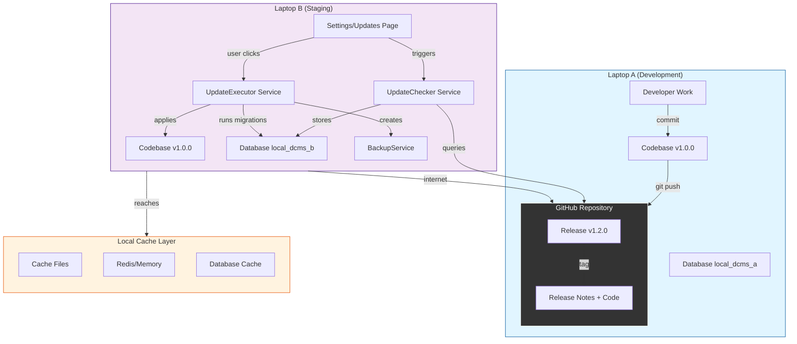
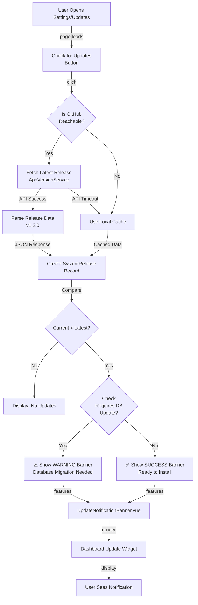
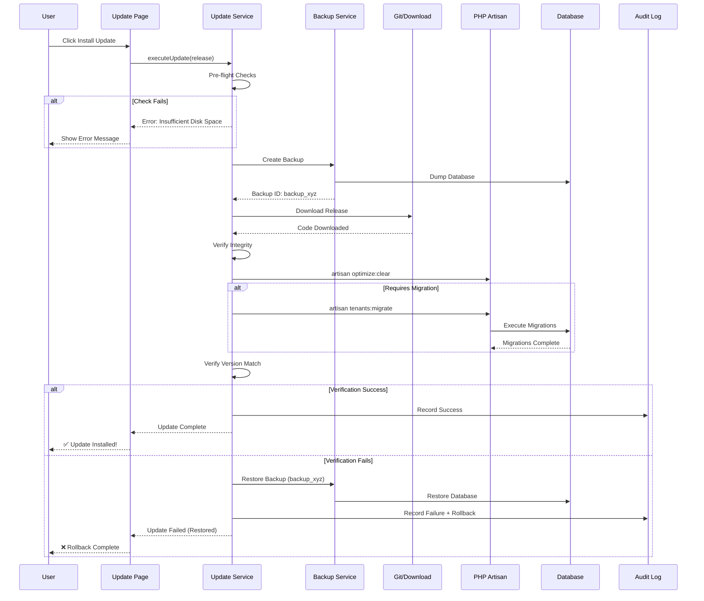
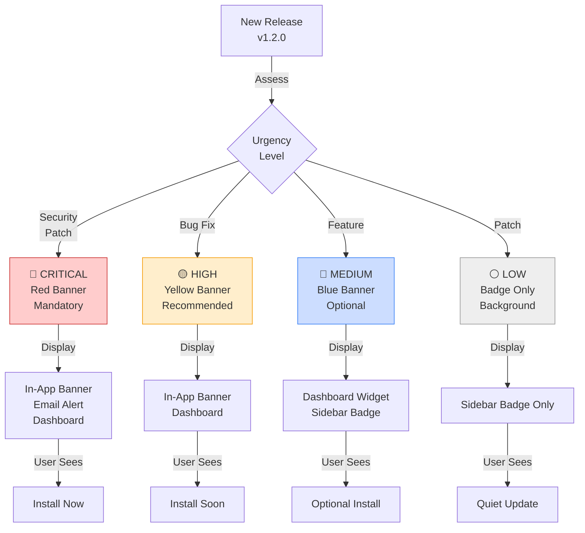
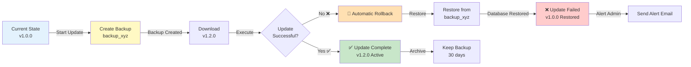
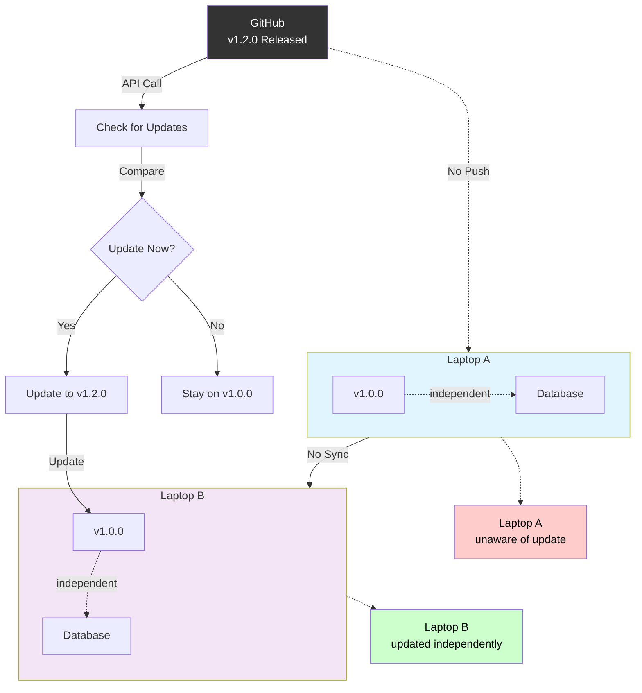
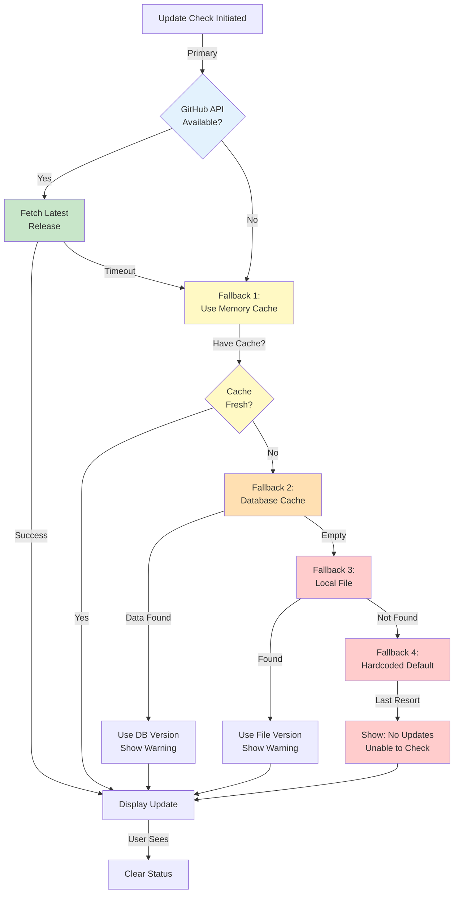
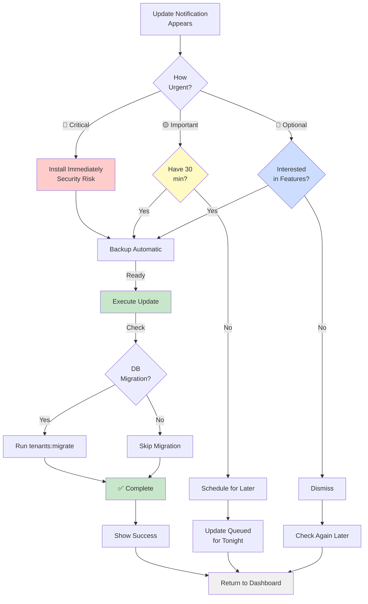

# Distributed Update Mechanism - Architecture Diagrams

## Diagram 1: Complete System Architecture Overview



---

## Diagram 2: Update Detection Flow



---

## Diagram 3: Update Execution Pipeline



---

## Diagram 4: Update Notification Hierarchy



---

## Diagram 5: Backup & Rollback Strategy



---

## Diagram 6: Multi-Laptop Independence Model



---

## Diagram 7: Error Handling & Fallback Chain



---

## Diagram 8: Release Tagging Convention

```mermaid
graph LR
    Release["New Release"]
    
    Release -->|Tag| Version["v1.2.3"]
    
    Release -->|Notes| Notes["Release Notes"]
    
    Version -->|Semantic| SemVer["1 = Major<br/>2 = Minor<br/>3 = Patch"]
    
    Notes -->|Contains| HasMigration{Contains<br/>[MIGRATION]?}
    
    HasMigration -->|Yes| Flag1["⚠️ requires_db_update<br/>= true"]
    HasMigration -->|No| Flag2["✅ requires_db_update<br/>= false"]
    
    Flag1 -->|Store| DB1["SystemRelease<br/>Table"]
    Flag2 -->|Store| DB1
    
    DB1 -->|Affects| UI["Update Notification<br/>Shows Warning?"]
    
    style Version fill:#e3f2fd
    style SemVer fill:#c8e6c9
    style Flag1 fill:#ffcccc
    style Flag2 fill:#c8e6c9
    style DB1 fill:#f3e5f5
    style UI fill:#fff9c4
```

---

## Diagram 9: User Decision Tree for Updates



---

## Diagram 10: Performance & Scalability View

```mermaid
graph TB
    subgraph Performance["Performance Characteristics"]
        direction TB
        A["GitHub API Check: 100-500ms"]
        B["Cache Hit: <5ms"]
        C["Create Backup: 30-120s"]
        D["Apply Update: 1-5 minutes"]
        E["Total Time: 5-15 minutes"]
    end
    
    subgraph Scalability["Scalability (Multi-tenant)"]
        direction TB
        F["Single Release Sync: O(1)"]
        G["Tenant Notification: O(n)"]
        H["Parallel Migrations: O(1)"]
        I["Queue-based Execution"]
    end
    
    subgraph Bottlenecks["Potential Bottlenecks"]
        direction TB
        J["Large DB Backup"]
        K["Network Timeout"]
        L["Concurrent Updates"]
        M["Disk Space"]
    end
    
    subgraph Solutions["Solutions"]
        direction TB
        N["Incremental Backups"]
        O["Retry with Backoff"]
        P["Queue Manager"]
        Q["Cleanup Policy"]
    end
    
    J -->|solve| N
    K -->|solve| O
    L -->|solve| P
    M -->|solve| Q
    
    style Performance fill:#c8e6c9
    style Scalability fill:#c8e6c9
    style Bottlenecks fill:#ffcccc
    style Solutions fill:#fff9c4
```



---

