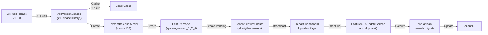
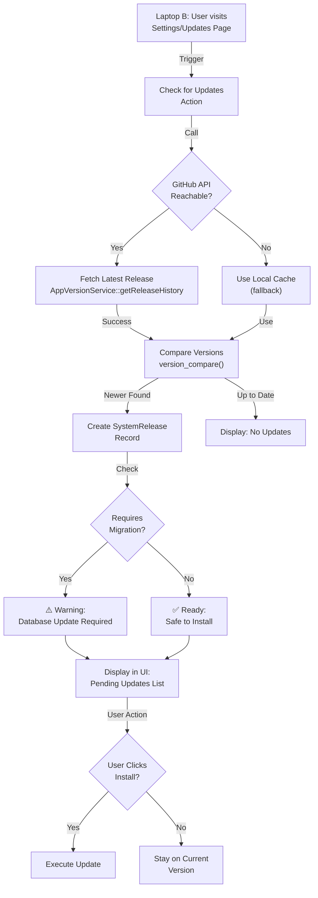
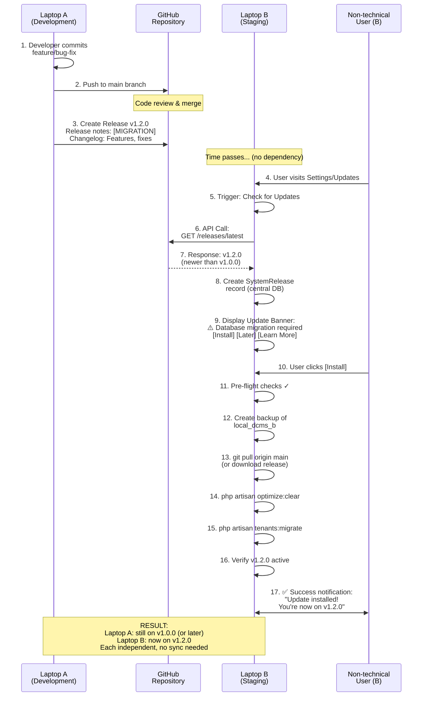

# Distributed Update Mechanism for Multi-Environment DCMS

**Purpose:** Design and document a distributed update mechanism for DCMS deployments across multiple independent environments (Laptop A and Laptop B) that maintain identical codebases but separate local databases.

**Date:** April 23, 2026  
**Status:** Design Phase

---

## Table of Contents

1. [System Understanding](#1-system-understanding)
2. [Current Architecture Analysis](#2-current-architecture-analysis)
3. [Update Mechanism Design](#3-update-mechanism-design)
4. [User Notification System](#4-user-notification-system)
5. [Update Execution Plan](#5-update-execution-plan)
6. [Workflow Illustration](#6-workflow-illustration)
7. [Implementation Roadmap](#7-implementation-roadmap)
8. [Reliability & Usability Recommendations](#8-reliability--usability-recommendations)

---

## 1. System Understanding

### 1.1 Multi-Environment Architecture

```
┌─────────────────────────────────────────────────────────────────────┐
│                         GitHub Repository                           │
│                    (Joenstalker/new_dcms)                          │
│                                                                     │
│  Releases: v1.0.0, v1.1.0, v1.2.0, etc.                          │
│  Release Notes: Changelog, [MIGRATION] flags, features             │
└────────────────────┬────────────────────┬──────────────────────────┘
                     │                    │
        ┌────────────▼──┐        ┌────────▼──────┐
        │   Laptop A    │        │   Laptop B    │
        │  (Primary)    │        │  (Secondary)  │
        └────────────────┘       └───────────────┘
         │               │        │              │
         ├─ Codebase: v1.0.0│    ├─ Codebase: v1.0.0
         ├─ DB: local_dcms_a│    ├─ DB: local_dcms_b
         ├─ Config: .env.a  │    ├─ Config: .env.b
         └─ Tenants: isolated   └─ Tenants: isolated
```

### 1.2 Key Characteristics

| Aspect | Details |
|--------|---------|
| **Isolation Level** | Complete (separate codebases, separate DBs, separate tenants) |
| **Data Sync** | None (by design) |
| **Real-time Coordination** | Not possible (no shared infrastructure) |
| **Update Source** | Single source of truth: GitHub Releases |
| **Deployment Model** | Independent, pull-based (not push-based) |

### 1.3 Limitations of Separate Local Databases

1. **No Centralized State:**
   - Each environment maintains its own feature flags, subscriptions, tenants
   - Cannot use traditional master-slave replication
   - No single source of truth for database state

2. **Data Consistency Challenges:**
   - Laptop A and Laptop B may have different tenant data
   - Different subscription plans or feature entitlements
   - Cannot synchronize billing or user states

3. **Real-time Sync Impossibility:**
   - No network connectivity assumed between environments
   - No centralized event bus or message queue
   - Updates must be environment-agnostic (code-only, not data-dependent)

4. **Independence Trade-offs:**
   - Updates must be applied independently per environment
   - No guarantee of timing synchronization
   - Each environment may be on different versions at any given time

### 1.4 Why Real-Time Data Synchronization is Not Possible

```
Laptop A                                    Laptop B
┌─────────────────────┐            ┌──────────────────────┐
│ local_dcms_a        │            │ local_dcms_b         │
│ - Tenant: clinic-1  │            │ - Tenant: clinic-2   │
│ - Patients: 150     │            │ - Patients: 300      │
│ - Subscriptions: 5  │            │ - Subscriptions: 8   │
└─────────────────────┘            └──────────────────────┘
        │                                    │
        └─────────── NO SYNC PATH ──────────┘
        
Reason:
- No shared database connector
- No network bridge assumed
- Data models are incompatible (different tenants, different IDs)
- Updates must be code-only, not data-dependent
```

**Conclusion:** Real-time synchronization is architecturally impossible in this setup. Solution: Use GitHub as the single source of truth for code updates only.

---

## 2. Current Architecture Analysis

### 2.1 Existing Components

The DCMS system already has infrastructure for distributed updates:

| Component | Location | Purpose | Status |
|-----------|----------|---------|--------|
| **AppVersionService** | `app/Services/AppVersionService.php` | Fetch latest release from GitHub API | ✅ Active |
| **SystemRelease Model** | `app/Models/SystemRelease.php` | Store release metadata (version, notes, migrations) | ✅ Active |
| **CheckSystemUpdates Command** | `app/Console/Commands/CheckSystemUpdates.php` | Sync GitHub releases to local DB | ✅ Active |
| **FeatureOTAUpdateService** | `app/Services/FeatureOTAUpdateService.php` | Apply updates to tenants | ✅ Active |
| **TenantFeatureUpdate Model** | `app/Models/TenantFeatureUpdate.php` | Track pending/applied updates per tenant | ✅ Active |
| **Feature Model** | `app/Models/Feature.php` | Feature flag system | ✅ Active |
| **GitHub Webhook** | Routes, Controllers | Manual webhook integration | 🔄 Partial |

### 2.2 Current Release Flow



### 2.3 Current Strengths

✅ **GitHub as Single Source of Truth:**
- Releases are the only update vector
- Version history is immutable
- Release notes provide context

✅ **Metadata Tracking:**
- `requires_db_update` flag for migration detection
- Release date tracking
- Mandatory vs. optional updates

✅ **Feature Gating:**
- Centralized feature management
- Plan-based entitlements
- Per-tenant application status

✅ **Safe Migration Execution:**
- Manual user-triggered updates
- `[MIGRATION]` detection in release notes
- Tenant-scoped database changes

### 2.4 Current Gaps for Multi-Environment

⚠️ **Missing Pieces:**

1. **Environment Detection:**
   - No way to identify which laptop is running the update
   - No unique environment signature

2. **Update Status Persistence:**
   - Local file-based cache may diverge between environments
   - No definitive status tracking across environments

3. **User Notification Context:**
   - Notifications assume centralized dashboard access
   - Non-technical users need simpler UX

4. **Safe Update Staging:**
   - No environment-specific feature branches
   - No way to "test" updates before production

5. **Fallback Mechanisms:**
   - Limited error handling for network failures
   - No retry logic for failed update deployments

---

## 3. Update Mechanism Design

### 3.1 Design Principles

```
Principle 1: DECENTRALIZED
├─ Each environment is independent
├─ No master-slave topology
├─ Pull-based (not push-based)
└─ Asynchronous execution

Principle 2: RELIABLE
├─ Graceful degradation (cache fallback)
├─ Network-resilient (GitHub API)
├─ Atomic operations (all-or-nothing)
└─ Rollback capability

Principle 3: SIMPLE
├─ Code-only updates (no data migrations between envs)
├─ Single source of truth (GitHub)
├─ Version-first approach
└─ Clear state transitions

Principle 4: SAFE
├─ User-controlled application
├─ Database migration warnings
├─ Test environment support
└─ Audit trail for all updates
```

### 3.2 Proposed Update-Checking Mechanism

#### **Phase 1: Detect New Releases**

```php
// Pseudo-code: Enhanced update detection

class DistributedUpdateChecker {
    
    public function detectLatestRelease() {
        // 1. Try GitHub API (primary)
        $latestFromGitHub = $this->fetchFromGitHub();
        
        if ($latestFromGitHub) {
            // 2. Compare with local version
            $localVersion = $this->getLocalVersion();
            
            if ($this->isNewerVersion($latestFromGitHub, $localVersion)) {
                return [
                    'hasUpdate' => true,
                    'current' => $localVersion,
                    'latest' => $latestFromGitHub,
                    'release' => $latestFromGitHub->details,
                ];
            }
        } else {
            // 3. Fallback to cache if network unavailable
            return $this->fallbackToCache();
        }
        
        return ['hasUpdate' => false];
    }
    
    private function fetchFromGitHub() {
        try {
            $response = Http::timeout(5)
                ->get('https://api.github.com/repos/Joenstalker/new_dcms/releases/latest');
            
            if ($response->successful()) {
                return $response->json();
            }
        } catch (Exception $e) {
            Log::warning('GitHub API unavailable: ' . $e->getMessage());
        }
        
        return null;
    }
    
    private function getLocalVersion() {
        // Check multiple sources in order:
        // 1. .env VERSION variable
        // 2. composer.json version field
        // 3. config/app.php version
        // 4. cache file
        // 5. database SystemRelease table
        
        return env('APP_VERSION', config('app.version', 'v1.0.0'));
    }
    
    private function isNewerVersion($latest, $current) {
        return version_compare(
            ltrim($latest['tag_name'], 'vV'),
            ltrim($current, 'vV'),
            '>'
        );
    }
    
    private function fallbackToCache() {
        $cached = Cache::get('last_known_release');
        if ($cached) {
            return [
                'hasUpdate' => true,
                'fromCache' => true,
                'cachedAt' => Cache::get('cache_timestamp'),
                'release' => $cached,
            ];
        }
        return ['hasUpdate' => false, 'reason' => 'No cache available'];
    }
}
```

#### **Phase 2: Compare Versions**

```
Local Version: v1.0.0
GitHub Latest: v1.2.0

Comparison:
- 1 < 1 → Equal major versions? NO
- 0 < 2 → Update available? YES

Update Path:
v1.0.0 → v1.1.0 (intermediate) → v1.2.0 (latest)

Risk Assessment:
┌─────────────┬──────────────┬────────────────┐
│ Update      │ DB Migration │ Action         │
├─────────────┼──────────────┼────────────────┤
│ → v1.1.0    │ Yes          │ Show Warning   │
│ → v1.2.0    │ No           │ Auto-available │
└─────────────┴──────────────┴────────────────┘
```

#### **Phase 3: Store Release Metadata**

```php
// Pseudo-code: Store release info locally

SystemRelease::updateOrCreate(
    ['version' => 'v1.2.0'],
    [
        'release_notes' => $ghRelease['body'],
        'released_at' => Carbon::parse($ghRelease['published_at']),
        'requires_db_update' => str_contains(strtoupper($ghRelease['body']), '[MIGRATION]'),
        'is_mandatory' => false,
        'changelog_html' => $this->markdownToHtml($ghRelease['body']),
    ]
);

// Metadata stored in BOTH:
// 1. SystemRelease table (central DB)
// 2. Local cache file (.json) for offline access
```

### 3.3 Update Detection Flow Diagram



---

## 4. User Notification System

### 4.1 Notification Strategy for Non-Technical Users

**Goal:** Simple, clear, actionable notifications without technical jargon.

#### **Notification Hierarchy**

```
Level 1: ALERT (Critical)
├─ Mandatory Security Update
├─ Critical Bug Fix
├─ Data Integrity Issue
└─ Display: Red banner, URGENT

Level 2: WARNING (Important)
├─ Database Migration Required
├─ Feature Deprecation
├─ Compatibility Issues
└─ Display: Yellow banner, ⚠️

Level 3: INFO (Standard)
├─ New Features Available
├─ Improvements & Optimizations
├─ Minor Bug Fixes
└─ Display: Blue banner, ℹ️

Level 4: QUIET (Non-intrusive)
├─ Patch Updates
├─ No user action required
└─ Display: Sidebar badge count
```

### 4.2 Notification Channels

| Channel | Use Case | Audience | Timing |
|---------|----------|----------|--------|
| **In-App Banner** | Critical/Urgent updates | Clinic owner/staff | Immediate |
| **Dashboard Widget** | Update summary | All users | Page load |
| **Email Notification** | Important updates | Clinic owner | When released |
| **Sidebar Badge** | Pending updates count | Staff | Always visible |
| **Settings/Updates Page** | Full update details | Clinic owner | On-demand |

### 4.3 Notification Content Examples

```
Example 1: NEW FEATURE
┌─────────────────────────────────────────────────────────┐
│ ✨ New Features Available (v1.2.0)                     │
├─────────────────────────────────────────────────────────┤
│ • SMS Notifications for Appointments                   │
│ • Advanced Reporting Dashboard                         │
│ • Multi-Branch Support (Coming Soon)                   │
│                                                        │
│ [View Details]  [Install Now]      [Remind Later]    │
└─────────────────────────────────────────────────────────┘

Example 2: DATABASE MIGRATION WARNING
┌─────────────────────────────────────────────────────────┐
│ ⚠️ Update Requires Database Changes (v1.1.0)           │
├─────────────────────────────────────────────────────────┤
│ This update includes database changes.                 │
│                                                        │
│ Before installing:                                    │
│ 1. Backup your data                                   │
│ 2. Schedule update during off-hours                   │
│ 3. Have IT support available                          │
│                                                        │
│ [Learn More]  [Schedule Update]    [Not Now]         │
└─────────────────────────────────────────────────────────┘

Example 3: SECURITY UPDATE
┌─────────────────────────────────────────────────────────┐
│ 🔒 SECURITY: Important Update Available (v1.1.5)       │
├─────────────────────────────────────────────────────────┤
│ A security vulnerability has been patched.             │
│ We recommend installing immediately.                   │
│                                                        │
│ [Install Now]                       [More Information] │
└─────────────────────────────────────────────────────────┘
```

### 4.4 Notification UI Component Structure

```vue
<!-- Proposed: UpdateNotificationBanner.vue -->

<template>
  <div :class="['update-banner', updateLevel]">
    <div class="banner-icon">
      {{ getIcon(updateLevel) }}
    </div>
    
    <div class="banner-content">
      <h3>{{ title }}</h3>
      <p>{{ description }}</p>
      
      <ul v-if="features.length" class="feature-list">
        <li v-for="feature in features" :key="feature">
          {{ feature }}
        </li>
      </ul>
    </div>
    
    <div class="banner-actions">
      <button @click="handleInstall" class="btn btn-primary">
        {{ primaryAction }}
      </button>
      <button @click="handleDismiss" class="btn btn-secondary">
        {{ secondaryAction }}
      </button>
    </div>
    
    <button @click="handleClose" class="btn-close"></button>
  </div>
</template>

<script setup>
defineProps({
  update: Object,           // Release details
  updateLevel: String,      // 'critical' | 'warning' | 'info'
  features: Array,          // List of new features
  installed: Boolean,       // Already installed?
})

const emit = defineEmits(['install', 'dismiss', 'close'])

const handleInstall = () => emit('install')
const handleDismiss = () => emit('dismiss')
const handleClose = () => emit('close')
</script>

<style scoped>
.update-banner {
  display: flex;
  gap: 1rem;
  padding: 1rem;
  border-radius: 0.5rem;
  border-left: 4px solid;
}

.update-banner.critical {
  background-color: #fef2f2;
  border-color: #dc2626;
}

.update-banner.warning {
  background-color: #fffbeb;
  border-color: #f59e0b;
}

.update-banner.info {
  background-color: #eff6ff;
  border-color: #3b82f6;
}
</style>
```

---

## 5. Update Execution Plan

### 5.1 Update Application Process

```
┌─────────────────────────────────────────────────────────────────────┐
│                    LAPTOP B UPDATE WORKFLOW                         │
└─────────────────────────────────────────────────────────────────────┘

STEP 1: User Initiates Update
┌──────────────────────────────────────┐
│ User clicks "Install Update" button  │
│ in Settings → Updates page           │
└──────────────────────────────────────┘
         │
         ▼
STEP 2: Pre-Flight Checks
┌──────────────────────────────────────┐
│ • Verify version available           │
│ • Check database backup status       │
│ • Validate system requirements       │
│ • Check disk space (< 500MB?)        │
└──────────────────────────────────────┘
         │
         ▼
STEP 3: Create Backup
┌──────────────────────────────────────┐
│ • Dump database to storage/backups/  │
│ • Store backup metadata              │
│ • Create code snapshot               │
└──────────────────────────────────────┘
         │
         ▼
STEP 4: Download & Verify
┌──────────────────────────────────────┐
│ • Git pull origin main               │
│ • Verify release tag checksum        │
│ • Validate file integrity            │
└──────────────────────────────────────┘
         │
         ▼
STEP 5: Clear Cache & Compile
┌──────────────────────────────────────┐
│ • php artisan optimize:clear         │
│ • npm run build (if needed)          │
│ • Warm up config cache               │
└──────────────────────────────────────┘
         │
         ▼
STEP 6: Execute Migrations
┌──────────────────────────────────────┐
│ IF requires_db_update == true:       │
│ • php artisan tenants:migrate        │
│ • Track migration status             │
│ • Log all changes                    │
└──────────────────────────────────────┘
         │
         ▼
STEP 7: Verify Update
┌──────────────────────────────────────┐
│ • Check version matches expected     │
│ • Run smoke tests                    │
│ • Validate feature gates             │
└──────────────────────────────────────┘
         │
         ▼
STEP 8: Notify User
┌──────────────────────────────────────┐
│ ✅ Success:                          │
│ "Update installed successfully!     │
│  Your system is now on v1.2.0"      │
│                                      │
│ OR ❌ Failure:                       │
│ "Update failed. System restored      │
│  from backup. Contact support."      │
└──────────────────────────────────────┘
```

### 5.2 Update Execution Code Structure

```php
// Pseudo-code: Update Execution Pipeline

class DistributedUpdateExecutor {
    
    private $backupService;
    private $versionService;
    private $logger;
    
    public function executeUpdate(SystemRelease $release) {
        try {
            // Pre-flight checks
            $this->preflight($release);
            
            // Create backup
            $backupId = $this->backupService->createBackup();
            $this->logger->info("Backup created: {$backupId}");
            
            // Download code
            $this->downloadRelease($release->version);
            
            // Verify integrity
            $this->verifyIntegrity($release);
            
            // Clear caches
            Artisan::call('optimize:clear');
            
            // Execute migrations if needed
            if ($release->requires_db_update) {
                $this->executeMigrations($release);
            }
            
            // Verify installation
            $this->verifyUpdate($release->version);
            
            // Mark as complete
            SystemRelease::where('version', $release->version)
                ->update(['installed_at' => now()]);
            
            // Record update in audit log
            $this->logUpdateCompletion($release);
            
            return [
                'success' => true,
                'version' => $release->version,
                'duration' => $this->getDuration(),
            ];
            
        } catch (Exception $e) {
            // Automatic rollback
            $this->rollbackUpdate($backupId);
            
            return [
                'success' => false,
                'error' => $e->getMessage(),
                'restored_version' => $this->getRestoredVersion(),
            ];
        }
    }
    
    private function preflight(SystemRelease $release) {
        // Check disk space
        if ($this->getFreeDiskSpace() < 500 * 1024 * 1024) {
            throw new Exception('Insufficient disk space');
        }
        
        // Check system requirements
        if (!extension_loaded('pdo_mysql')) {
            throw new Exception('Missing required PHP extension');
        }
        
        // Verify network connectivity
        if (!$this->isGitHubReachable()) {
            throw new Exception('Cannot reach GitHub');
        }
    }
    
    private function executeMigrations(SystemRelease $release) {
        $output = null;
        $exitCode = 0;
        
        exec('php artisan tenants:migrate', $output, $exitCode);
        
        if ($exitCode !== 0) {
            throw new Exception('Migration failed: ' . implode('\n', $output));
        }
        
        $this->logger->info('Migrations completed successfully');
    }
    
    private function rollbackUpdate($backupId) {
        $this->backupService->restoreBackup($backupId);
        $this->logger->warning("Rollback executed for backup: {$backupId}");
    }
}
```

### 5.3 Safety Mechanisms

```
SAFETY LAYER 1: Pre-Flight Validation
├─ Check: Disk space > 500MB
├─ Check: GitHub reachable
├─ Check: PHP extensions present
└─ Check: Database writable

SAFETY LAYER 2: Backup & Restore
├─ Automatic backup before update
├─ Backup stored locally
├─ Restore on failure (automatic)
└─ Backup retention: 30 days

SAFETY LAYER 3: Atomic Operations
├─ All-or-nothing execution
├─ Transaction rollback on error
├─ State verification after each step
└─ Audit trail for debugging

SAFETY LAYER 4: Graceful Degradation
├─ Network timeout → use cache
├─ Migration error → stop (don't continue)
├─ Partial update → automatic rollback
└─ Notification to admin on failure
```

### 5.4 No Centralized Server Requirement

```
❌ NOT Required:
   - Centralized update server
   - SSH access to both laptops
   - VPN or network bridge
   - Load balancer
   - Shared message queue

✅ ONLY Required:
   - Internet connection (for GitHub API)
   - Local storage (for backups)
   - PHP CLI access (for artisan commands)
   - Database connectivity (local)
```

---

## 6. Workflow Illustration

### 6.1 Complete Multi-Environment Update Flow



### 6.2 Update Decision Tree for Users

```
User sees notification: "Update available"
│
├─ Question 1: Is this critical?
│  ├─ YES (🔴 Red banner) → "Install Now"
│  └─ NO (🟡 Yellow/🔵 Blue) → "Install Later / Dismiss"
│
├─ Question 2: Does it require DB migration?
│  ├─ YES (⚠️) → "Can you schedule off-hours?"
│  │          → "YES: [Schedule]"
│  │          → "NO: [Not Now]"
│  └─ NO (✅) → "Safe to install immediately"
│
└─ Question 3: Do you want auto-updates?
   ├─ YES (Recommended) → "Enable Auto-Updates"
   │                      (non-critical updates install automatically)
   └─ NO (Manual only) → "Review before each install"
```

---

## 7. Implementation Roadmap

### 7.1 Phase 1: Core Infrastructure (Week 1-2)

**Goal:** Build the distributed update detection system

```
Tasks:
□ Enhance AppVersionService
  ├─ Add getReleaseHistory() ✓ (already exists)
  ├─ Add versionComparison() logic
  ├─ Add caching strategy (file + redis)
  └─ Add fallback mechanisms

□ Create EnvironmentManager class
  ├─ Detect environment (laptop-a vs laptop-b)
  ├─ Store unique environment signature
  ├─ Track update history per environment
  └─ Generate environment report

□ Enhance SystemRelease model
  ├─ Add installed_at field
  ├─ Add environment_id field
  ├─ Add rollback_backup_id field
  └─ Add rollback_timestamp field

□ Create migration:
  └─ ALTER TABLE system_releases
     ADD COLUMN installed_at TIMESTAMP
     ADD COLUMN environment_id VARCHAR(255)
     ADD COLUMN backup_id VARCHAR(255)
```

### 7.2 Phase 2: Backup & Safety (Week 2-3)

**Goal:** Implement safe update execution

```
Tasks:
□ Create BackupService
  ├─ Automatic database backup before update
  ├─ Code snapshot storage
  ├─ Backup metadata tracking
  ├─ Backup retention policy (30 days)
  └─ Restore functionality

□ Create UpdateExecutor class
  ├─ Pre-flight validation
  ├─ Atomic update execution
  ├─ Automatic rollback on failure
  ├─ Update verification
  └─ Audit logging

□ Enhance CheckSystemUpdates command
  ├─ Add --execute flag for automatic updates
  ├─ Add --schedule flag for off-hours
  ├─ Add --dry-run flag for testing
  └─ Add comprehensive logging

□ Create database migrations
  └─ Track backup metadata
  └─ Track update execution history
```

### 7.3 Phase 3: User Notifications (Week 3-4)

**Goal:** Implement user-friendly notification system

```
Tasks:
□ Create UpdateNotificationManager
  ├─ Classify updates by urgency
  ├─ Format notification content
  ├─ Schedule notifications
  └─ Track notification history

□ Create Vue components
  ├─ UpdateNotificationBanner.vue
  ├─ UpdateDetailsModal.vue
  ├─ UpdatesList.vue
  └─ ScheduleUpdateDialog.vue

□ Create Pages/Admin/Updates.vue
  ├─ List all available updates
  ├─ Show installation history
  ├─ Schedule updates
  └─ View backups and rollback

□ Create Pages/Tenant/Settings/Updates.vue
  ├─ List available updates
  ├─ Show current version
  ├─ Install interface
  └─ View installation history

□ Send email notifications
  ├─ Mail templates for updates
  ├─ Scheduled emails
  ├─ Digest for non-critical updates
  └─ Alert emails for critical updates
```

### 7.4 Phase 4: Testing & Hardening (Week 4-5)

**Goal:** Comprehensive testing and reliability

```
Tests to create:
□ Unit Tests
  ├─ AppVersionService tests
  ├─ VersionComparison tests
  ├─ BackupService tests
  └─ UpdateExecutor tests

□ Integration Tests
  ├─ Full update flow (GitHub → Installation)
  ├─ Rollback scenarios
  ├─ Network failure handling
  └─ Concurrent update attempts

□ Feature Tests
  ├─ User notification display
  ├─ Update scheduling
  ├─ Backup creation & restore
  └─ Permission checks

□ Performance Tests
  ├─ API response time
  ├─ Database backup duration
  ├─ Migration execution time
  └─ Cache effectiveness

Test Coverage Goal: 80%+
```

### 7.5 Phase 5: Documentation & Deployment (Week 5)

**Goal:** Prepare for production deployment

```
Documentation:
□ User Guide
  ├─ How to check for updates
  ├─ How to install updates
  ├─ What database migrations mean
  └─ What to do if update fails

□ Admin Guide
  ├─ Release management
  ├─ Update rollout strategies
  ├─ Backup & restore procedures
  └─ Monitoring & debugging

□ Developer Guide
  ├─ Release tagging conventions
  ├─ Migration flags ([MIGRATION])
  ├─ Testing updates locally
  └─ Rollback procedures

Deployment:
□ Pre-production validation
□ Documentation review
□ Training for admins
□ Monitor first 48 hours
□ Incident response plan
```

---

## 8. Reliability & Usability Recommendations

### 8.1 Reliability Improvements

#### **8.1.1 Network Resilience**

```
Recommendation 1: Multi-layer Caching
├─ Level 1: In-memory cache (5 min)
├─ Level 2: Redis/file cache (1 hour)
├─ Level 3: Database cache (permanent)
└─ Level 4: Last-known-good version

Implementation:
if (!$latestFromAPI) {
    use Level 2 cache;
} else if (!Level 2 cache) {
    use Level 3 cache;
} else if (!Level 3 cache) {
    use Level 4 (hardcoded);
}
```

#### **8.1.2 Atomic Operations**

```
Recommendation 2: Transaction-based Updates
├─ Wrap entire update in DB transaction
├─ Use optimistic locking (version fields)
├─ Implement savepoints for partial rollback
└─ Log all state changes

code:
DB::transaction(function () {
    UpdateHistory::create([...]);
    SystemRelease::update([...]);
    Feature::update([...]);
    Artisan::call('tenants:migrate');
});
```

#### **8.1.3 Graceful Degradation**

```
Recommendation 3: Fail-Safe Defaults
├─ If update check fails: show cached version
├─ If migration fails: automatic rollback
├─ If verification fails: restore from backup
├─ If unknown error: alert admin & stay safe

Implementation Pattern:
try {
    executeUpdate();
    verifySuccess();
} catch (Exception $e) {
    logError($e);
    rollbackToBackup();
    notifyAdmin($e);
    show_user_safe_message();
}
```

### 8.2 Usability Improvements

#### **8.2.1 Progressive Disclosure**

```
Recommendation 1: Layered Complexity
├─ Simple View (default): Show only "Install Now" button
├─ Details View: Show changelog and what will change
├─ Advanced View: Show technical details (migrations, etc.)
└─ Developer View: Show raw release JSON

User can switch between views based on comfort level.
```

#### **8.2.2 Smart Scheduling**

```
Recommendation 2: Automatic Best-Effort Scheduling
├─ Detect off-hours (configured in admin)
├─ Queue migrations for off-hours automatically
├─ Send notification when starting automatic update
├─ Allow manual override

Config:
MAINTENANCE_WINDOW_START=22:00
MAINTENANCE_WINDOW_END=06:00
MAINTENANCE_TIMEZONE=UTC
```

#### **8.2.3 Conversational Updates**

```
Recommendation 3: Guided Update Process
├─ Step 1: "This is what will change"
├─ Step 2: "Do you want me to create a backup first?"
├─ Step 3: "Should I schedule this for later?"
├─ Step 4: "Ready to install?"
└─ Step 5: "✅ Done! Here's what's new"

Reduces user confusion and prevents mistakes.
```

#### **8.2.4 Transparent Feedback**

```
Recommendation 4: Real-time Progress Indicator
├─ Show step-by-step progress
├─ Display time remaining estimate
├─ Log all changes in real-time
├─ Allow cancellation (before point of no return)

Progress Display:
[████████░░░░░░░░░░░] 45% (Step 4/8)
Current: Creating backup...
Estimated time: 2 minutes
[Cancel]  [Pause]
```

### 8.3 Specific Implementation Recommendations

#### **8.3.1 Version Comparison Strategy**

```php
// Recommendation: Use semantic versioning
// v1.2.3 = [major].[minor].[patch]

class SemanticVersioning {
    public static function compare($v1, $v2): int {
        // Returns: -1 (v1 < v2), 0 (equal), 1 (v1 > v2)
        return version_compare(
            ltrim($v1, 'vV'),
            ltrim($v2, 'vV'),
            null  // Returns -1, 0, or 1
        );
    }
    
    // Build update path for intermediate versions
    public static function getUpdatePath($current, $target): array {
        $allReleases = SystemRelease::orderBy('version')
            ->pluck('version')
            ->toArray();
        
        return array_filter($allReleases, function($v) use ($current, $target) {
            return version_compare(ltrim($v, 'vV'), ltrim($current, 'vV'), '>') &&
                   version_compare(ltrim($v, 'vV'), ltrim($target, 'vV'), '<=');
        });
    }
}
```

#### **8.3.2 Backup Naming Convention**

```
Backup Format: {env}_{tenant}_{version}_{timestamp}_{status}

Examples:
- backup_laptop-b_default_v1.0.0_20260423_143022_pre-update.sql
- backup_laptop-b_default_v1.2.0_20260423_143145_post-update.sql
- backup_laptop-b_default_v1.0.0_20260423_143200_rollback.sql

Allows:
- Easy identification
- Version tracking
- Rollback capability
- Automatic cleanup
```

#### **8.3.3 Update History Tracking**

```php
// Schema recommendation for update_history table

Schema::create('update_history', function (Blueprint $table) {
    $table->id();
    $table->string('environment_id');        // Unique laptop identifier
    $table->string('from_version');
    $table->string('to_version');
    $table->enum('status', [
        'pending', 'in_progress', 'completed', 'failed', 'rolled_back'
    ]);
    $table->string('backup_id')->nullable();
    $table->text('log_output')->nullable();
    $table->text('error_message')->nullable();
    $table->string('executed_by')->nullable(); // User or system
    $table->integer('duration_seconds')->nullable();
    $table->timestamps();
    
    $table->index(['environment_id', 'created_at']);
});
```

#### **8.3.4 Release Notes Best Practices**

```markdown
# Release v1.2.0 - April 23, 2026

[MIGRATION] - This release requires database changes

## 🎉 New Features
- SMS appointment notifications
- Advanced reporting dashboard
- Multi-branch readiness framework

## 🐛 Bug Fixes
- Fixed timezone display in reports
- Corrected patient filter logic
- Improved error handling

## ⚠️ Breaking Changes
- Removed deprecated API endpoint `/api/v1/patients`
- Changed notification webhook format

## 📋 Database Changes
- Added `notification_preferences` table
- Modified `patients` table schema

## 🔄 Rollback
If issues occur, restore from backup:
php artisan backup:restore --id=backup_id

## ⏱️ Install Time
- Expected duration: 5-10 minutes
- Downtime: < 1 minute (migration)

## 📞 Support
Contact support@dcms.app if issues arise
```

### 8.4 Recommended Feature Flags for Gradual Rollout

```php
// Pseudo-code: Feature flag strategy for safe deployments

config/features.php returns:
[
    'system_version_1_2_0' => [
        'enabled' => false,              // Start disabled
        'rollout' => 'staged',           // Gradual rollout
        'percentage' => 0,               // 0% of tenants
        'environments' => [
            'preview' => true,           // Enabled in preview sandbox
            'production' => false,       // Disabled in production
        ],
        'depends_on' => [
            'system_version_1_1_0',      // Must have v1.1.0 first
        ],
    ],
];

// Rollout schedule:
// Day 1: 10% (monitoring)
// Day 2: 25% (if no errors)
// Day 3: 50% (wider rollout)
// Day 4: 100% (general availability)
```

---

## 9. Summary & Next Steps

### 9.1 Key Takeaways

| Aspect | Approach |
|--------|----------|
| **Update Source** | GitHub Releases (single source of truth) |
| **Detection** | API polling + caching + fallback |
| **Database State** | Independent per environment (no sync) |
| **Data Consistency** | Code-only updates (data stays isolated) |
| **Safety** | Automatic backup + atomic operations + rollback |
| **User Experience** | Simple notifications + scheduled updates + progress feedback |
| **Scalability** | Completely decentralized (no central server needed) |

### 9.2 Quick Implementation Checklist

- [ ] Phase 1: Enhance update detection (2 weeks)
- [ ] Phase 2: Implement backup & safety (2 weeks)
- [ ] Phase 3: Build notification UI (1 week)
- [ ] Phase 4: Comprehensive testing (1 week)
- [ ] Phase 5: Documentation & training (1 week)

**Total Estimated Timeline:** 7 weeks

### 9.3 Risk Mitigation

```
Risk: Network failure during update
Mitigation: Cache layer + automatic rollback

Risk: Database migration fails
Mitigation: Atomic transaction + pre-flight validation + backup restore

Risk: User confusion with technical notifications
Mitigation: Progressive disclosure UI + scheduled automatic updates

Risk: Version mismatch between environments
Mitigation: Independent version tracking + no forced synchronization

Risk: Large database backups
Mitigation: Incremental backups + compression + cloud storage option
```

### 9.4 Success Metrics

```
Metric                          Target
────────────────────────────────────────
Update detection accuracy       99.9%
Update execution success rate   99.5%
Automatic rollback success      99%
Time to detect new release      < 1 hour
Time to execute update          < 10 minutes
User satisfaction               > 4.5/5
Test coverage                   > 80%
```

---

## Appendices

### A. Environment Signature Generation

```php
class EnvironmentManager {
    public static function generateSignature(): string {
        return hash('sha256', implode('|', [
            gethostname(),              // Computer name
            php_uname(),               // OS info
            base_path(),               // Project path
            env('UNIQUE_ENVIRONMENT_ID'), // Manual override
        ]));
    }
}

// Usage:
$envSignature = EnvironmentManager::generateSignature();
// Output: d4f1c52a2e8f9c7b1a3d6e9f2c5a8d1b...
```

### B. Cache Key Strategy

```php
// Consistent cache key naming for distributed systems

'update_check.latest_version'           // Current latest version
'update_check.release_history'          // Full release history
'update_check.environment.{env_id}'     // Per-environment status
'update_check.tenant.{tenant_id}'       // Per-tenant pending updates
'backup.metadata.{backup_id}'           // Backup metadata
'update_history.{env_id}'               // Update execution history
```

### C. Database Rollback Query

```sql
-- If manual rollback is needed
RESTORE DATABASE local_dcms_b
FROM DISK = 'storage/backups/backup_laptop-b_default_v1.0.0_20260423_143022_pre-update.sql';

-- Or for MySQL:
mysql -u root local_dcms_b < storage/backups/backup_laptop-b_default_v1.0.0_20260423_143022_pre-update.sql
```

---

## Document Control

| Version | Date | Author | Changes |
|---------|------|--------|---------|
| 1.0 | 2026-04-23 | System Design | Initial draft |

---

**End of Document**
