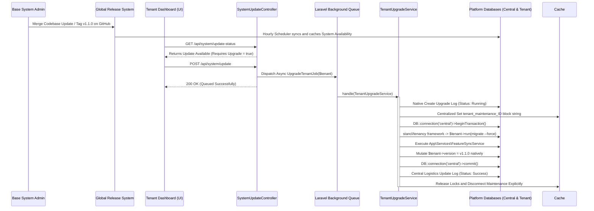
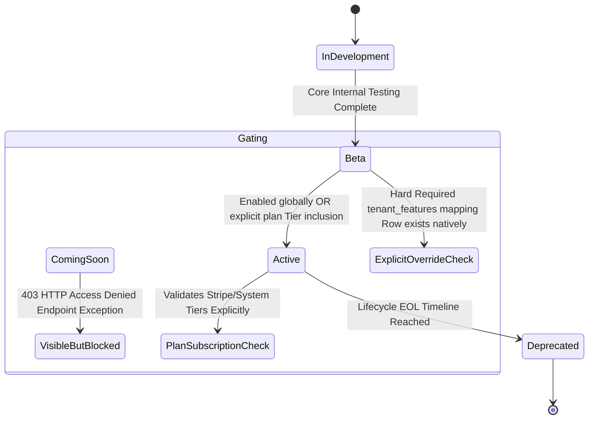
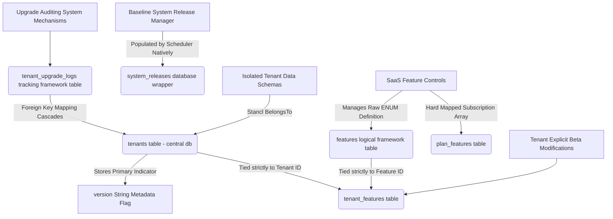

# SaaS Multi-Tenancy Architecture Final Review & Report

This document completely validates the fully decoupled, transactionally secure SaaS Multi-Tenancy application update process engineered globally over the 9-phase orchestration pipeline.

---

## 1. Upgrade Lifecycle Diagram

The sequence heavily prioritizes a completely unresponsive-free environment for the Clinic Operators. Long-running migrations are handled directly by the isolated Queue workers.

---

## 2. Feature Lifecycle Diagram

The engine manages isolated Beta releases seamlessly without sacrificing central Tier planning and billing subscriptions seamlessly. Feature states dynamically govern endpoint security routing via checking constraints exactly where they lie dynamically.

---

## 3. Database Interaction Flow

The logical bridging strictly preserves Landlord separation over singular Tenant records intelligently.

---

## 4. Scalability Risks

- **MySQL Connection Thrashing via Concurrency Execution:** During massive global "Force Core Migration" events via queued execution across 3,000+ branch databases concurrently, default generic PDO settings could easily exhaust native server communication ports or RAM limitations almost immediately unless strictly bound.
- **Cache Redis Protocol Eviction Issues:** Depending exclusively on Redis/File Cache instances for the `tenant_maintenance_ID` string configurations could result in phantom maintenance locks mysteriously disappearing prior to migration termination. High payload stress on Redis occasionally natively flushes memory strategies, breaking migration locks securely.
- **Context Swapping Resource Overhead Strategies:** Switching generic standard PDO schema contexts dynamically and rapidly over 1,000 respective tenants utilizes a non-zero footprint latency per-request loop. Operations at massive scaling numbers balloon overall global background runtime operations immensely natively.

---

## 5. Suggested Optimizations

- **Queue Execution Limits and Throttling:** Implement `Redis::funnel` or `Redis::throttle` locally alongside native implementations directly inside the `UpgradeTenantJob` to ensure a rigid ceiling of *N* tenant schemas migrating uniformly (e.g. `allow(10)->every(10)`) per active core environment, safely suppressing random burst payload DB exhaustion effectively.
- **Real-Time Websocket Integrations (Broadcasting):** Dispatch an event (e.g. `TenantUpgradeCompleted`) cleanly at the end of the `try/catch` matrix located deep natively in `TenantUpgradeService`. Frameworks like Laravel Reverb inherently catch these payloads to broadcast specific localized realtime UI notifications exactly explicitly informing administrative users the back-end system installations processed correctly, skipping UI polling requirements totally effectively.
- **Database Partition Management Lifecycle Rules:** Implementing natively automated PRUNING. Because the structural array maps everything sequentially to `tenant_upgrade_logs`, the size multiplies enormously efficiently. Implementing a localized `php artisan model:prune` natively onto the model restricts legacy arrays older than ~6 months continuously efficiently.
