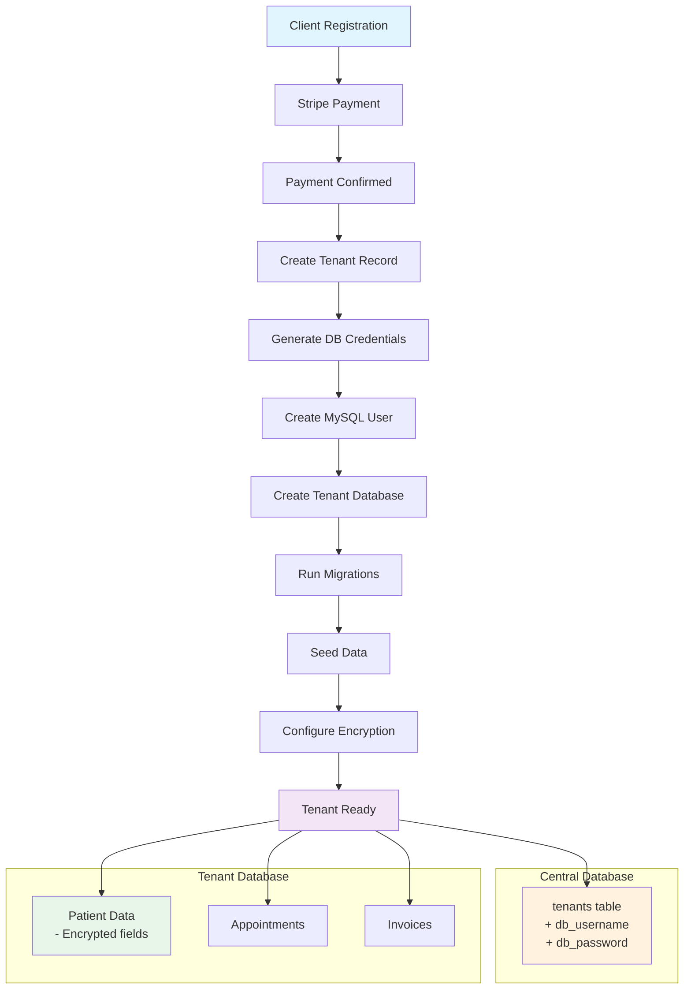

# DCMS Full Data Isolation Implementation Plan

## Executive Summary

This plan outlines the implementation of **Full Data Isolation** for the DCMS (Dental Clinic Management System) multi-tenant SaaS platform. The goal is to ensure strict tenant database isolation, prevent cross-tenant data access, implement separate database users per tenant, and enable encrypted data at rest.

---

## Current Architecture Analysis

### Existing Implementation
- **Package**: `stancl/tenancy` (v3) - Laravel multi-tenancy package
- **Pattern**: Database-per-tenant with prefix `tenant` + UUID (e.g., `tenant69b544d605817`)
- **Identification**: Subdomain-based (e.g., `dental.lvh.me`)
- **Payment**: Stripe integration for subscription plans
- **Database**: MySQL (central: `new_dcms_db`, tenants: `tenant{uuid}`)

### NEW: Domain-Based Database Naming
- **Proposed Pattern**: Database-per-tenant using subdomain name
- **Format**: `{subdomain}_dcms_db` (e.g., `dental_dcms_db`, `smilesmile_dcms_db`)
- **Benefits**: 
  - Human-readable database names
  - Easy to identify which clinic owns which database
  - Simplified debugging and maintenance

> **Note**: The tenant ID will still use UUID internally for uniqueness, but the actual MySQL database name will be derived from the subdomain.

### Current Tenant Creation Flow
1. User registers → validates account details
2. User selects subdomain → checks availability
3. User selects plan → creates Stripe checkout session
4. User pays → webhook confirms payment
5. On success → creates Tenant + Domain + User + Subscription
6. Tenant database is automatically created and migrated

---

## Implementation Roadmap

### Phase 1: Database-Level Tenant Isolation

#### 1.0 Domain-Based Database Naming (NEW REQUIREMENT)
- **Configuration**: `config/tenancy.php`
- **Current**: Database names like `tenant69b544d605817`
- **Proposed**: Database names like `{subdomain}_dcms_db`
- **Implementation**:

```php
// config/tenancy.php
'database' => [
    'central_connection' => env('DB_CONNECTION', 'central'),
    'template_tenant_connection' => null,
    
    // CHANGE THESE:
    'prefix' => '',  // Remove prefix
    'suffix' => '_dcms_db',  // Add suffix: dental_dcms_db, smilesmile_dcms_db
],
```

#### 1.1 Sanitize Subdomain for Database Name
- **File**: `app/Services/TenantDatabaseNamingService.php` (NEW)
- **Purpose**: Clean subdomain to be valid MySQL database name
- **Rules**:
  - Convert to lowercase
  - Replace special characters with underscores
  - Remove invalid MySQL characters
  - Limit to 64 characters (MySQL limit)
  - Example: `Dental-Clinic_123` → `dental_clinic_123_dcms_db`

#### 1.2 Enable Permission-Controlled MySQL Database Manager
- **File**: `config/tenancy.php`
- **Change**: Switch from `MySQLDatabaseManager` to `PermissionControlledMySQLDatabaseManager`
- **Purpose**: Creates separate MySQL user for each tenant with restricted permissions

```php
// config/tenancy.php - Change this:
'managers' => [
    'mysql' => Stancl\Tenancy\TenantDatabaseManagers\MySQLDatabaseManager::class,
]

// To this:
'managers' => [
    'mysql' => Stancl\Tenancy\TenantDatabaseManagers\PermissionControlledMySQLDatabaseManager::class,
]
```

#### 1.2 Configure Database User Permissions
- **File**: Create custom database manager or extend existing one
- **Permissions needed**:
  - SELECT, INSERT, UPDATE, DELETE on tenant database
  - No access to central database
  - No CREATE/DROP DATABASE permissions
  - No access to other tenants' databases

---

### Phase 2: Tenant Database User Separation

#### 2.1 Create Tenant Database User Manager
- **New File**: `app/Services/TenantDatabaseUserManager.php`
- **Responsibilities**:
  - Generate unique database credentials per tenant
  - Create MySQL user with restricted permissions
  - Store credentials securely (encrypted in central DB)
  - Rotate credentials periodically

#### 2.2 Update Tenant Model
- **File**: `app/Models/Tenant.php`
- **Add fields**:
  - `db_username` - encrypted database username
  - `db_password` - encrypted database password
  - `status` - active/inactive/suspended
  - `created_by` - admin user ID

#### 2.3 Create Database User Migration
- **File**: `database/migrations/xxxx_xx_xx_add_db_credentials_to_tenants_table.php`
- **Add columns**: `db_username`, `db_password` (both encrypted)

---

### Phase 3: Data Encryption at Rest

#### 3.1 Configure MySQL Transparent Data Encryption (TDE)
- **Requirement**: MySQL 8.0+ with InnoDB tablespace encryption
- **Configuration**: Update MySQL configuration (`my.cnf`)
- **Alternative**: Laravel encryption for sensitive fields

#### 3.2 Add Laravel Field-Level Encryption
- **Fields to encrypt**:
  - Patient: IC number, phone, address, medical history
  - User: Personal details
  - Subscription: Payment information
- **Implementation**: Use Laravel's `Encryptable` trait or manual encryption

#### 3.3 Create Encryption Service
- **New File**: `app/Services/DataEncryptionService.php`
- **Methods**:
  - `encryptField($value, $key)`
  - `decryptField($value, $key)`
  - `hashForIntegrity($data)`

---

### Phase 4: Cross-Tenant Access Prevention

#### 4.1 Strict Tenant Context Validation
- **File**: `app/Http/Middleware/IdentifyTenant.php` (already exists - enhance it)
- **Enhancements**:
  - Verify tenant status is 'active'
  - Check subscription is valid
  - Validate database connection belongs to tenant

#### 4.2 Database Connection Guard
- **New File**: `app/Providers/TenantDatabaseGuard.php`
- **Purpose**: Ensure queries only execute within correct tenant context
- **Implementation**: Override query builder to validate tenant ID

#### 4.3 Add Tenant ID to All Queries
- **Files**: All tenant models (`Patient`, `Appointment`, `Treatment`, etc.)
- **Change**: Add global scope to ensure tenant_id is always present
- **Migration**: Add `tenant_id` foreign key to all tenant tables

---

### Phase 5: Update Registration Flow

#### 5.1 Modify RegistrationController
- **File**: `app/Http/Controllers/RegistrationController.php`
- **Add steps**:
  1. Generate unique database credentials
  2. Create tenant database user
  3. Store encrypted credentials
  4. Set up initial encryption keys

#### 5.2 Update Tenant Creation Event
- **File**: `app/Providers/TenancyServiceProvider.php`
- **Add jobs**:
  - CreateDatabaseUser job
  - ConfigureEncryption job

---

### Phase 6: Environment Configuration

#### 6.1 Update .env File
```env
# Data Isolation Settings
TENANT_DB_ISOLATION=enabled
TENANT_DB_USER_PREFIX=tenant_user_
TENANT_DB_SUFFIX=_dcms_db  # Database suffix: dental_dcms_db, smilesmile_dcms_db
ENCRYPTION_ENABLED=true
ENCRYPTION_KEY=base64:xxx  # Generate new key

# MySQL TDE (if available)
MYSQL_TDE_ENABLED=false  # Set true for production MySQL 8.0+
```

#### 6.2 Add Configuration Files
- **File**: `config/isolation.php`
- **Settings**: Isolation level, encryption algorithm, key rotation period

---

## Detailed Todo List

### Database-Level Isolation
- [ ] 1.0 Configure domain-based database naming (subdomain_dcms_db)
- [ ] 1.0b Create TenantDatabaseNamingService for sanitization
- [ ] 1.1 Update tenancy.php to use PermissionControlledMySQLDatabaseManager
- [ ] 1.2 Configure database user grants/permissions
- [ ] 1.3 Test tenant database creation with new user

### Tenant Database User Separation
- [ ] 2.1 Create TenantDatabaseUserManager service
- [ ] 2.2 Add db_username and db_password fields to Tenant model
- [ ] 2.3 Create migration for new fields
- [ ] 2.4 Implement credential generation and storage

### Data Encryption
- [ ] 3.1 Configure MySQL TDE in my.cnf (production)
- [ ] 3.2 Create DataEncryptionService
- [ ] 3.3 Add encryption to sensitive patient fields
- [ ] 3.4 Add encryption to sensitive user fields

### Cross-Tenant Prevention
- [ ] 4.1 Enhance IdentifyTenant middleware with strict validation
- [ ] 4.2 Create TenantDatabaseGuard
- [ ] 4.3 Add tenant_id to all tenant tables (migration)
- [ ] 4.4 Add global scope to Tenant models

### Registration Updates
- [ ] 5.1 Update handleSuccess in RegistrationController
- [ ] 5.2 Add CreateDatabaseUser job to TenancyServiceProvider
- [ ] 5.3 Update SeedTenantDatabase job

### Configuration
- [ ] 6.1 Update .env with isolation settings
- [ ] 6.2 Create config/isolation.php
- [ ] 6.3 Document environment variables

---

## Security Considerations

### Threat Model
1. **SQL Injection**: Tenant A accessing Tenant B's data
2. **Accidental Cross-Tenant Queries**: Missing WHERE clauses
3. **Database Admin Abuse**: Central DB admin accessing tenant data
4. **Data Theft**: Stolen database backups

### Mitigations
| Threat | Mitigation |
|--------|------------|
| SQL Injection | Parameterized queries, tenant ID validation |
| Accidental Queries | Global scopes, database guard |
| DB Admin Abuse | Separate DB users, encryption at rest |
| Data Theft | TDE, field-level encryption, access logs |

---

## Testing Plan

### Unit Tests
- TenantDatabaseUserManager: credential generation
- DataEncryptionService: encrypt/decrypt operations

### Integration Tests
- Tenant creation flow with database user
- Cross-tenant query prevention
- Encryption/decryption of patient data

### Security Tests
- Attempt cross-tenant access (should fail)
- Verify tenant isolation at database level

---

## Implementation Priority

1. **P0 - Critical**: Domain-based database naming (1.0)
2. **P0 - Critical**: Tenant ID on all tables, global scopes
3. **P0 - Critical**: Cross-tenant query prevention middleware
4. **P1 - High**: Database user separation
5. **P1 - High**: Field-level encryption
6. **P2 - Medium**: MySQL TDE configuration
7. **P2 - Medium**: Credential rotation

---

## Files to Modify

| File | Action |
|------|--------|
| `config/tenancy.php` | Update database prefix/suffix, use PermissionControlledMySQLDatabaseManager |
| `app/Models/Tenant.php` | Add credential fields |
| `app/Http/Controllers/RegistrationController.php` | Add credential creation |
| `app/Providers/TenancyServiceProvider.php` | Add new jobs |
| `app/Http/Middleware/IdentifyTenant.php` | Enhance validation |
| `.env` | Add isolation settings |

## Files to Create

| File | Purpose |
|------|---------|
| `app/Services/TenantDatabaseNamingService.php` | Sanitize subdomain → valid DB name |
| `app/Services/TenantDatabaseUserManager.php` | DB user management |
| `app/Services/DataEncryptionService.php` | Field encryption |
| `app/Providers/TenantDatabaseGuard.php` | Query guard |
| `config/isolation.php` | Isolation config |
| `database/migrations/xxxx_add_db_credentials.php` | New fields |

---

## Diagram: Data Isolation Architecture



---

## Next Steps

Once you approve this plan, we can begin implementation. The tasks are designed to be modular so you can prioritize:

- **Start with Phase 1-2** for basic tenant isolation
- **Continue with Phase 3-4** for security hardening
- **Finish with Phase 5-6** for complete implementation
