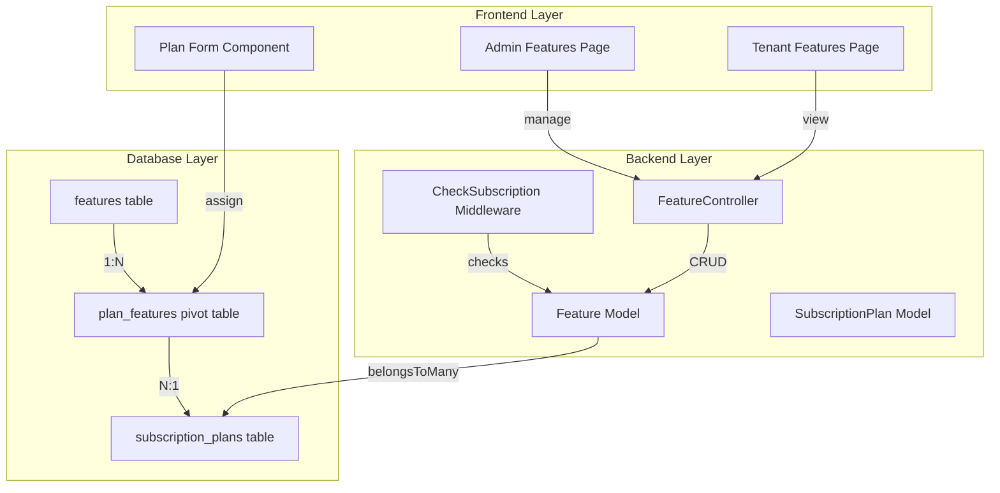

# Feature Management Implementation Plan

## Executive Summary

Transform the current hardcoded feature flag system into a **dynamic Feature Management system** that allows administrators to create, manage, and configure features without code changes. This system will benefit tenants by providing a clear, flexible view of their available features and limits.

---

## Current System Analysis

### Existing Implementation

| Component | Current State |
|-----------|---------------|
| **Database** | Features stored as boolean columns (`has_qr_booking`, `has_sms`, etc.) in `subscription_plans` table |
| **Model** | `SubscriptionPlan` model with hardcoded fillable array |
| **Middleware** | `CheckSubscription` middleware with hardcoded feature name checks |
| **Frontend (Admin)** | `Admin/Plans/Partials/PlanForm.vue` with hardcoded checkbox fields |
| **Frontend (Tenant)** | `Settings/Index.vue` displaying subscription features |
| **Admin Layout** | Placeholder menu item for "Feature Management" (no route) |

---

## Feature Requirements (from FLOW.md)

### Core Features (Available to All Plans)

| Feature Key | Display Name | Description | Implemented |
|-------------|--------------|-------------|-------------|
| `qr_booking` | QR Code Online Booking | QR code-based appointment booking | ✅ Yes |
| `appointment_scheduling` | Appointment Scheduling | Calendar and scheduling management | ✅ Yes |
| `patient_records` | Patient Information Management | Patient records CRUD operations | ✅ Yes |
| `billing_pos` | Billing & POS | Billing and point of sale | ✅ Yes |
| `clinic_setup` | Clinic Setup & Branding | Clinic info and branding customization | ✅ Yes |
| `role_based_access` | Role-Based Access Control | Owner/Dentist/Assistant roles | ✅ Yes |

### Limits by Plan

| Feature Key | Display Name | Basic | Pro | Ultimate | Implemented |
|-------------|--------------|-------|-----|----------|-------------|
| `max_users` | Maximum Staff Users | 4 | 6 | 10 | ✅ Yes |
| `max_patients` | Maximum Patients | 150 | 1000 | Unlimited | ✅ Yes |
| `max_appointments` | Maximum Appointments | 500 | 2000 | Unlimited | ✅ Yes |

### Add-on Features

| Feature Key | Display Name | Basic | Pro | Ultimate | Implemented |
|-------------|--------------|-------|-----|----------|-------------|
| `sms_notifications` | SMS Appointment Notifications | ❌ | ✅ | ✅ | ✅ Yes |
| `custom_branding` | Custom Clinic Branding | ❌ | ✅ | ✅ | ✅ Yes |
| `priority_support` | Priority Support | ❌ | ❌ | ✅ | ✅ Yes |

### Reports Features

| Feature Key | Display Name | Basic | Pro | Ultimate | Implemented |
|-------------|--------------|-------|-----|----------|-------------|
| `basic_reports` | Basic Reports | ✅ | ✅ | ✅ | ✅ Yes |
| `enhanced_reports` | Enhanced Reports | ❌ | ✅ | ✅ | ✅ Yes |
| `advanced_analytics` | Advanced Analytics | ❌ | ❌ | ✅ | ✅ Yes |

### Expansion Features

| Feature Key | Display Name | Basic | Pro | Ultimate | Implemented |
|-------------|--------------|-------|-----|----------|-------------|
| `multi_branch` | Multi-branch Readiness | ❌ | ❌ | ✅ | ✅ Yes |

---

## Architecture Overview



---

## Implementation Steps

### Phase 1: Database & Models

#### 1.1 Create Features Table Migration

Create `database/migrations/2026_03_15_000002_create_features_table.php`:

```php
Schema::create('features', function (Blueprint $table) {
    $table->id();
    $table->string('key')->unique();           // qr_booking, max_patients, etc.
    $table->string('name');                     // Display name
    $table->text('description')->nullable();  // Feature description
    $table->enum('type', ['boolean', 'numeric', 'tiered']);
    $table->string('category')->nullable();    // core, limits, addons, reports, expansion
    $table->json('options')->nullable();       // For tiered: ['basic', 'enhanced', 'advanced']
    $table->integer('sort_order')->default(0);
    $table->boolean('is_active')->default(true);
    $table->timestamps();
});
```

#### 1.2 Create Plan Features Pivot Table

Create `database/migrations/2026_03_15_000003_create_plan_features_table.php`:

```php
Schema::create('plan_features', function (Blueprint $table) {
    $table->id();
    $table->foreignId('subscription_plan_id')->constrained()->cascadeOnDelete();
    $table->foreignId('feature_id')->constrained()->cascadeOnDelete();
    $table->boolean('value_boolean')->nullable();    // For boolean type
    $table->integer('value_numeric')->nullable();    // For numeric type (limits)
    $table->string('value_tier')->nullable();       // For tiered type
    $table->timestamps();
    
    $table->unique(['subscription_plan_id', 'feature_id']);
});
```

#### 1.3 Create Feature Model

Create `app/Models/Feature.php`:

```php
class Feature extends Model
{
    protected $fillable = ['key', 'name', 'description', 'type', 'category', 'options', 'sort_order', 'is_active'];
    
    protected $casts = [
        'options' => 'array',
        'is_active' => 'boolean',
    ];
    
    public function plans()
    {
        return $this->belongsToMany(SubscriptionPlan::class, 'plan_features')
            ->withPivot('value_boolean', 'value_numeric', 'value_tier')
            ->withTimestamps();
    }
}
```

#### 1.4 Update SubscriptionPlan Model

Update `app/Models/SubscriptionPlan.php`:

- Remove hardcoded feature columns from fillable
- Add `features()` relationship
- Add helper methods: `hasFeature($key)`, `getFeatureValue($key)`

#### 1.5 Create Feature Seeder (Complete from FLOW.md)

Create `database/seeders/FeatureSeeder.php`:

```php
$features = [
    // === CORE FEATURES (Available to All) ===
    ['key' => 'qr_booking', 'name' => 'QR Code Online Booking', 'type' => 'boolean', 'category' => 'core', 'sort_order' => 1],
    ['key' => 'appointment_scheduling', 'name' => 'Appointment Scheduling', 'type' => 'boolean', 'category' => 'core', 'sort_order' => 2],
    ['key' => 'patient_records', 'name' => 'Patient Information Management', 'type' => 'boolean', 'category' => 'core', 'sort_order' => 3],
    ['key' => 'billing_pos', 'name' => 'Billing & POS', 'type' => 'boolean', 'category' => 'core', 'sort_order' => 4],
    ['key' => 'clinic_setup', 'name' => 'Clinic Setup & Branding', 'type' => 'boolean', 'category' => 'core', 'sort_order' => 5],
    ['key' => 'role_based_access', 'name' => 'Role-Based Access Control', 'type' => 'boolean', 'category' => 'core', 'sort_order' => 6],
    
    // === LIMITS ===
    ['key' => 'max_users', 'name' => 'Maximum Staff Users', 'type' => 'numeric', 'category' => 'limits', 'sort_order' => 10],
    ['key' => 'max_patients', 'name' => 'Maximum Patients', 'type' => 'numeric', 'category' => 'limits', 'sort_order' => 11],
    ['key' => 'max_appointments', 'name' => 'Maximum Appointments', 'type' => 'numeric', 'category' => 'limits', 'sort_order' => 12],
    
    // === ADD-ONS ===
    ['key' => 'sms_notifications', 'name' => 'SMS Appointment Notifications', 'type' => 'boolean', 'category' => 'addons', 'sort_order' => 20],
    ['key' => 'custom_branding', 'name' => 'Custom Clinic Branding', 'type' => 'boolean', 'category' => 'addons', 'sort_order' => 21],
    ['key' => 'priority_support', 'name' => 'Priority Support', 'type' => 'boolean', 'category' => 'addons', 'sort_order' => 22],
    
    // === REPORTS ===
    ['key' => 'report_level', 'name' => 'Report Level', 'type' => 'tiered', 'category' => 'reports', 
     'options' => ['basic', 'enhanced', 'advanced'], 'sort_order' => 30],
    ['key' => 'advanced_analytics', 'name' => 'Advanced Analytics', 'type' => 'boolean', 'category' => 'reports', 'sort_order' => 31],
    
    // === EXPANSION ===
    ['key' => 'multi_branch', 'name' => 'Multi-branch Readiness', 'type' => 'boolean', 'category' => 'expansion', 'sort_order' => 40],
];
```

#### 1.6 Create Plan Feature Seeder

Create plan feature values based on existing seed data:

```php
// Basic Plan (Plan ID 1)
['max_users' => 4, 'max_patients' => 150, 'max_appointments' => 500, 
 'qr_booking' => true, 'appointment_scheduling' => true, 'patient_records' => true,
 'billing_pos' => true, 'clinic_setup' => true, 'role_based_access' => true,
 'report_level' => 'basic', 'sms_notifications' => false, 'custom_branding' => false,
 'priority_support' => false, 'advanced_analytics' => false, 'multi_branch' => false]

// Pro Plan (Plan ID 2)
['max_users' => 6, 'max_patients' => 1000, 'max_appointments' => 2000,
 'qr_booking' => true, 'appointment_scheduling' => true, 'patient_records' => true,
 'billing_pos' => true, 'clinic_setup' => true, 'role_based_access' => true,
 'report_level' => 'enhanced', 'sms_notifications' => true, 'custom_branding' => true,
 'priority_support' => false, 'advanced_analytics' => false, 'multi_branch' => false]

// Ultimate Plan (Plan ID 3)
['max_users' => 10, 'max_patients' => null, 'max_appointments' => null,
 'qr_booking' => true, 'appointment_scheduling' => true, 'patient_records' => true,
 'billing_pos' => true, 'clinic_setup' => true, 'role_based_access' => true,
 'report_level' => 'advanced', 'sms_notifications' => true, 'custom_branding' => true,
 'priority_support' => true, 'advanced_analytics' => true, 'multi_branch' => true]
```

---

### Phase 2: Backend Implementation

#### 2.1 Create Feature Controller

Create `app/Http/Controllers/Admin/FeatureController.php`:

```php
class FeatureController extends Controller
{
    public function index();           // List all features (with category grouping)
    public function store(Request $request);     // Create new feature
    public function update(Request $request, Feature $feature);    // Update feature
    public function destroy(Feature $feature);   // Delete feature
    
    public function assignToPlan(Request $request, Feature $feature);    // Assign feature to plan
    public function removeFromPlan(Feature $feature, SubscriptionPlan $plan);   // Remove from plan
    
    public function getPlanFeatures(SubscriptionPlan $plan);  // Get features for a plan
}
```

#### 2.2 Update CheckSubscription Middleware

Update `app/Http/Middleware/CheckSubscription.php`:

- Replace hardcoded feature checks with dynamic database lookups
- Query `Feature` model instead of checking `$plan->has_*` columns

```php
// New dynamic checking approach
$feature = Feature::where('key', $feature)->first();
if ($feature) {
    $planFeature = $subscription->plan->features()->where('feature_id', $feature->id)->first();
    // Check value based on feature type
}
```

#### 2.3 Update PlanController

Update `app/Http/Controllers/Admin/PlanController.php`:

- Add feature assignment in `store()` and `update()`
- Pass available features to the form

---

### Phase 3: Frontend Implementation

#### 3.1 Create Admin Features Page

Create `resources/js/Pages/Admin/Features/Index.vue`:

- Table listing all features grouped by category
- Add/Create/Edit feature modal
- Toggle feature active status
- Drag-and-drop reordering

#### 3.2 Create Admin Feature Form

Create `resources/js/Pages/Admin/Features/Partials/FeatureForm.vue`:

- Feature key input (system identifier)
- Feature name input
- Description textarea
- Type selector (boolean/numeric/tiered)
- Category selector (core/limits/addons/reports/expansion)
- Options input (for tiered: JSON or multi-select)
- Sort order input

#### 3.3 Update Plan Form Component

Update `resources/js/Pages/Admin/Plans/Partials/PlanForm.vue`:

- Replace hardcoded checkboxes with dynamic feature list
- Group features by category
- Different input types based on feature type:
  - Boolean → Checkbox
  - Numeric → Number input
  - Tiered → Select dropdown

#### 3.4 Create Tenant Features Page

Create `resources/js/Pages/Settings/Features.vue`:

**Display Sections:**
- Current Plan Name & Status
- Category: Core Features (all true, read-only display)
- Category: Limits (shows actual values)
- Category: Add-ons (enabled/disabled with upgrade prompts)
- Category: Reports (tiered display)
- Category: Expansion (enabled/disabled)

**UI Elements:**
- Group features by category with visual cards
- Green checkmark for enabled features
- Grayed out for disabled features with "Upgrade to unlock" button
- Shows actual numeric limits (e.g., "150 patients")
- Tiered features show current level with upgrade path

#### 3.5 Update Admin Layout

Update `resources/js/Layouts/AdminLayout.vue`:

- Change Feature Management menu item route from `null` to `admin.features.index`

---

### Phase 4: API & Routes

#### 4.1 Add Routes

Update `routes/web.php`:

```php
// Admin Feature Management
Route::get('/admin/features', [FeatureController::class, 'index'])->name('admin.features.index');
Route::post('/admin/features', [FeatureController::class, 'store'])->name('admin.features.store');
Route::put('/admin/features/{feature}', [FeatureController::class, 'update'])->name('admin.features.update');
Route::delete('/admin/features/{feature}', [FeatureController::class, 'destroy'])->name('admin.features.destroy');

// Plan Feature Assignment
Route::post('/admin/features/{feature}/assign', [FeatureController::class, 'assignToPlan'])->name('admin.features.assign');
Route::delete('/admin/features/{feature}/remove', [FeatureController::class, 'removeFromPlan'])->name('admin.features.remove');
```

---

## Backward Compatibility

To maintain backward compatibility during transition:

1. **Keep existing `has_*` columns** on `subscription_plans` for migration period
2. **Create helper method** that checks both old columns and new pivot table
3. **Gradual migration**: New features use pivot, old features still work from columns
4. **Deprecation warnings** in logs when old columns are accessed

---

## Testing Checklist

- [ ] Create new feature via admin panel
- [ ] Assign feature to plan with different value types (boolean/numeric/tiered)
- [ ] Verify tenant sees updated features in Settings
- [ ] Verify middleware blocks access for disabled features
- [ ] Verify numeric limits are enforced (max_users, max_patients, max_appointments)
- [ ] Verify tiered features work correctly (report_level)
- [ ] Test feature deletion (should not break plans)
- [ ] Test plan deletion (should remove pivot records)

---

## Files to Create/Modify

### New Files

| File | Purpose |
|------|---------|
| `database/migrations/2026_03_15_000002_create_features_table.php` | Features table |
| `database/migrations/2026_03_15_000003_create_plan_features_table.php` | Pivot table |
| `app/Models/Feature.php` | Feature model |
| `app/Http/Controllers/Admin/FeatureController.php` | Feature CRUD controller |
| `database/seeders/FeatureSeeder.php` | Default features (16 features) |
| `database/seeders/PlanFeatureSeeder.php` | Plan feature values |
| `resources/js/Pages/Admin/Features/Index.vue` | Admin features list |
| `resources/js/Pages/Admin/Features/Partials/FeatureForm.vue` | Feature form |
| `resources/js/Pages/Settings/Features.vue` | Tenant features page |

### Modified Files

| File | Changes |
|------|---------|
| `app/Models/SubscriptionPlan.php` | Add features relationship, helper methods |
| `app/Http/Middleware/CheckSubscription.php` | Dynamic feature checking |
| `app/Http/Controllers/Admin/PlanController.php` | Feature assignment |
| `resources/js/Pages/Admin/Plans/Partials/PlanForm.vue` | Dynamic feature inputs |
| `resources/js/Layouts/AdminLayout.vue` | Add route for features |
| `routes/web.php` | Add feature routes |

---

## Feature Summary Table

| # | Category | Feature Key | Display Name | Type | Basic | Pro | Ultimate |
|---|----------|-------------|--------------|------|-------|-----|----------|
| 1 | Core | qr_booking | QR Code Online Booking | boolean | ✅ | ✅ | ✅ |
| 2 | Core | appointment_scheduling | Appointment Scheduling | boolean | ✅ | ✅ | ✅ |
| 3 | Core | patient_records | Patient Information Management | boolean | ✅ | ✅ | ✅ |
| 4 | Core | billing_pos | Billing & POS | boolean | ✅ | ✅ | ✅ |
| 5 | Core | clinic_setup | Clinic Setup & Branding | boolean | ✅ | ✅ | ✅ |
| 6 | Core | role_based_access | Role-Based Access Control | boolean | ✅ | ✅ | ✅ |
| 7 | Limits | max_users | Maximum Staff Users | numeric | 4 | 6 | 10 |
| 8 | Limits | max_patients | Maximum Patients | numeric | 150 | 1000 | ∞ |
| 9 | Limits | max_appointments | Maximum Appointments | numeric | 500 | 2000 | ∞ |
| 10 | Add-ons | sms_notifications | SMS Appointment Notifications | boolean | ❌ | ✅ | ✅ |
| 11 | Add-ons | custom_branding | Custom Clinic Branding | boolean | ❌ | ✅ | ✅ |
| 12 | Add-ons | priority_support | Priority Support | boolean | ❌ | ❌ | ✅ |
| 13 | Reports | report_level | Report Level | tiered | basic | enhanced | advanced |
| 14 | Reports | advanced_analytics | Advanced Analytics | boolean | ❌ | ❌ | ✅ |
| 15 | Expansion | multi_branch | Multi-branch Readiness | boolean | ❌ | ❌ | ✅ |

**Total Features: 15**
