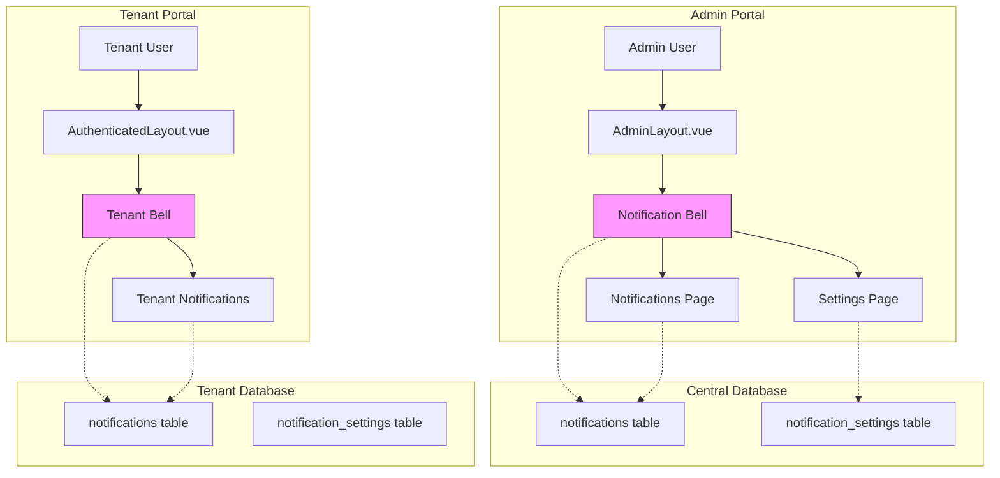

# Notification System Implementation Plan

## Overview
This document outlines the implementation of a comprehensive notification system for the DCMS (Dental Clinic Management System) Admin and Tenant portals.

## Current State Analysis

### Project Structure
- **Framework**: Laravel 10 + Inertia.js + Vue 3
- **Multi-tenancy**: Stancl/Tenancy (database-per-tenant)
- **Authentication**: Laravel Breeze
- **User Roles**:
  - `is_admin = 1` → SaaS Admin
  - `Owner` → Tenant clinic owner
  - `Dentist` → Dentist staff
  - `Assistant` → Assistant staff

### Existing Components
- **AdminLayout.vue**: Has placeholder "Notifications" menu item (Coming Soon)
- **AuthenticatedLayout.vue**: Used for Tenant portal
- **User model**: Already uses Laravel's `Notifiable` trait

---

## Requirements Analysis

### Admin Portal Notifications
1. **Notification Bell** in header showing unread count
2. **Notifications Tab** - management page to enable/disable notification types
3. **Notification Types for Admin**:
   - New tenant registrations
   - Subscription renewals/expirations
   - New support tickets
   - Platform analytics alerts
   - Feature request notifications

### Tenant Portal Notifications
1. **Notification Bell** in header showing unread count
2. **Notifications List** page
3. **Notification Types for Tenant**:
   - **From Staff (Dentist/Assistant)**:
     - Appointment updates
     - Patient records updates
     - Treatment completion alerts
   - **From Admin/System**:
     - New features available
     - Subscription reminders
     - Upcoming billing due dates
     - Feature requests/surveys

---

## Database Design

### Central Database (for Admin Notifications)

#### Table: `notifications`
```php
Schema::create('notifications', function (Blueprint $table) {
    $table->uuid('id')->primary();
    $table->foreignId('user_id')->constrained()->onDelete('cascade'); // Recipient
    $table->string('type'); // e.g., 'subscription_expiring', 'new_tenant'
    $table->string('title');
    $table->text('message');
    $table->json('data')->nullable(); // Additional data
    $table->string('channel')->default('database'); // database, email, both
    $table->boolean('is_read')->default(false);
    $table->timestamp('read_at')->nullable();
    $table->timestamps();
});
```

#### Table: `notification_settings`
```php
Schema::create('notification_settings', function (Blueprint $table) {
    $table->id();
    $table->foreignId('user_id')->constrained()->onDelete('cascade');
    $table->string('type'); // notification type identifier
    $table->boolean('enabled')->default(true);
    $table->string('channel')->default('database');
    $table->timestamps();
    
    $table->unique(['user_id', 'type']);
});
```

### Tenant Database (for Tenant Notifications)

#### Table: `notifications` (tenant-specific)
```php
Schema::create('notifications', function (Blueprint $table) {
    $table->uuid('id')->primary();
    $table->foreignId('user_id')->constrained('users')->onDelete('cascade');
    $table->string('type');
    $table->string('title');
    $table->text('message');
    $table->json('data')->nullable();
    $table->string('sender_type')->nullable(); // 'User', 'System', 'Admin'
    $table->foreignId('sender_id')->nullable();
    $table->boolean('is_read')->default(false);
    $table->timestamp('read_at')->nullable();
    $table->timestamps();
});
```

#### Table: `notification_settings` (tenant-specific)
```php
Schema::create('notification_settings', function (Blueprint $table) {
    $table->id();
    $table->foreignId('user_id')->constrained('users')->onDelete('cascade');
    $table->string('type');
    $table->boolean('enabled')->default(true);
    $table->timestamps();
    
    $table->unique(['user_id', 'type']);
});
```

---

## API/Controller Design

### Admin Portal Controllers

#### `app/Http/Controllers/Admin/NotificationController.php`
```php
class NotificationController extends Controller
{
    // Display notifications list
    public function index(Request $request) {}
    
    // Mark notification as read
    public function markAsRead(Request $request, string $id) {}
    
    // Mark all as read
    public function markAllAsRead() {}
    
    // Get unread count (API for bell)
    public function getUnreadCount() {}
    
    // Delete notification
    public function destroy(string $id) {}
    
    // Settings management
    public function settings() {}
    public function updateSettings(Request $request) {}
}
```

### Tenant Portal Controllers

#### `app/Http/Controllers/Tenant/NotificationController.php`
```php
class NotificationController extends Controller
{
    // Display notifications list
    public function index(Request $request) {}
    
    // Create notification (from staff)
    public function store(Request $request) {}
    
    // Mark as read
    public function markAsRead(string $id) {}
    
    // Mark all as read
    public function markAllAsRead() {}
    
    // Get unread count
    public function getUnreadCount() {}
}
```

---

## Notification Types Definition

### Admin Notification Types
| Type | Title Template | Description |
|------|-----------------|-------------|
| `new_tenant` | New Tenant Registration | When a new tenant signs up |
| `tenant_suspended` | Tenant Suspended | When a tenant is suspended |
| `subscription_created` | New Subscription | When tenant subscribes |
| `subscription_expiring` | Subscription Expiring | 7 days before expiration |
| `subscription_expired` | Subscription Expired | After expiration |
| `new_support_ticket` | New Support Ticket | When tenant submits ticket |
| `feature_request` | Feature Request | When tenant requests feature |

### Tenant Notification Types
| Type | Sender | Title Template | Description |
|------|--------|----------------|-------------|
| `appointment_created` | System | New Appointment | When appointment is scheduled |
| `appointment_updated` | System | Appointment Updated | When appointment is modified |
| `appointment_cancelled` | System | Appointment Cancelled | When appointment is cancelled |
| `patient_added` | Staff | New Patient | When patient is added |
| `treatment_completed` | Staff | Treatment Complete | When treatment is done |
| `new_feature` | Admin | New Feature Available | System pushes new feature |
| `subscription_reminder` | System | Subscription Reminder | Before billing date |
| `payment_due` | System | Payment Due | Upcoming payment |
| `staff_message` | Staff | Message from Staff | Direct message from staff |

---

## Frontend Implementation

### Components Structure

```
resources/js/
├── Components/
│   ├── NotificationBell.vue        # Reusable bell component
│   ├── NotificationDropdown.vue    # Dropdown list
│   └── NotificationItem.vue       # Single notification item
└── Pages/
    ├── Admin/
    │   └── Notifications/
    │       ├── Index.vue          # Notification list
    │       └── Settings.vue       # Settings management
    └── Tenant/
        └── Notifications/
            └── Index.vue          # Tenant notification list
```

### Layout Updates

#### AdminLayout.vue
- Add NotificationBell in header (top-right)
- Update menu to link to notifications page

#### AuthenticatedLayout.vue
- Add NotificationBell in header (top-right)
- Add notifications route to navigation

---

## Trigger Points (Where Notifications Are Created)

### Admin Notifications
1. **New Tenant Registration** → `RegistrationController::handleSuccess()`
2. **Subscription Events** → `SubscriptionController` (via Stripe webhooks)
3. **Support Tickets** → `SupportTicketController::store()`

### Tenant Notifications
1. **Appointment Created** → `AppointmentController::store()`
2. **Appointment Updated** → `AppointmentController::update()`
3. **Patient Created** → `PatientController::store()`
4. **Treatment Completed** → `TreatmentController::store()`
5. **Staff Messages** → Direct from Staff

---

## Implementation Steps (Detailed)

### Phase 1: Database & Models
1. Create migration: `create_notifications_table` (central)
2. Create migration: `create_notification_settings_table` (central)
3. Create migration: `create_notifications_table` (tenant)
4. Create migration: `create_notification_settings_table` (tenant)
5. Create `app/Models/Notification.php`
6. Create `app/Models/NotificationSettings.php`

### Phase 2: Controllers & Routes
1. Create `app/Http/Controllers/Admin/NotificationController.php`
2. Create `app/Http/Controllers/Tenant/NotificationController.php`
3. Add admin routes
4. Add tenant routes

### Phase 3: Frontend Components
1. Create `NotificationBell.vue` component
2. Create `NotificationDropdown.vue` component
3. Create `NotificationItem.vue` component

### Phase 4: Pages
1. Create `Pages/Admin/Notifications/Index.vue`
2. Create `Pages/Admin/Notifications/Settings.vue`
3. Create `Pages/Tenant/Notifications/Index.vue`

### Phase 5: Layout Integration
1. Update `AdminLayout.vue` - add bell, update menu
2. Update `AuthenticatedLayout.vue` - add bell

### Phase 6: Notification Triggers
1. Add triggers in relevant controllers
2. Create notification service/facade

---

## Mermaid Architecture Diagram



---

## Acceptance Criteria

### Admin Portal
- [ ] Notification bell appears in header with unread count badge
- [ ] Clicking bell shows dropdown with recent 5 notifications
- [ ] Can navigate to full notifications list page
- [ ] Can mark notifications as read
- [ ] Can mark all notifications as read
- [ ] Can access settings to enable/disable notification types
- [ ] Notifications are created for: new tenant, subscription events, support tickets

### Tenant Portal
- [ ] Notification bell appears in header with unread count badge
- [ ] Clicking bell shows dropdown with recent 5 notifications
- [ ] Can navigate to full notifications list page
- [ ] Can mark notifications as read
- [ ] Can mark all notifications as read
- [ ] Dentist/Assistant can send notifications to Owner
- [ ] Owner receives notifications from staff
- [ ] System notifications for: appointments, patients, treatments
- [ ] Admin can push notifications to tenants (new features, reminders)
