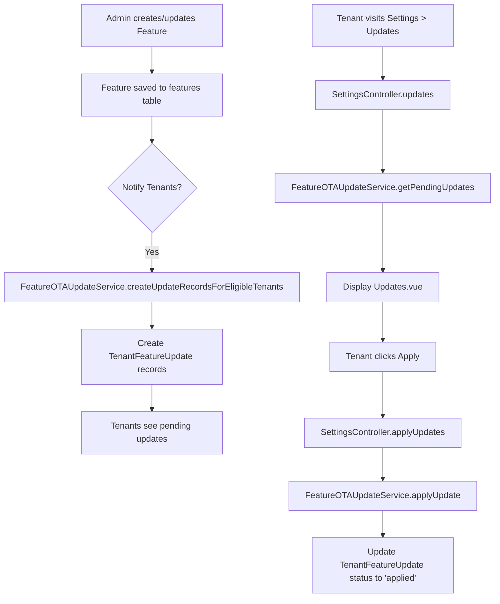

# OTA Feature Management System - Analysis Report

## Executive Summary

The Over-the-Air (OTA) Feature Management system is designed to allow administrators to manage feature rollouts to tenants. The system enables:
1. **Admins** to create features and notify tenants
2. **Tenants** to view pending updates and acknowledge/apply them

---

## Current Implementation Status

### ✅ COMPLETE Components

#### 1. Database Migrations

| Migration | File | Status |
|-----------|------|--------|
| OTA Fields | [`database/migrations/2026_03_19_000001_add_ota_fields_to_features_table.php`](database/migrations/2026_03_19_000001_add_ota_fields_to_features_table.php) | ✅ Implemented |
| Tenant Updates | [`database/migrations/2026_03_19_000002_create_tenant_feature_updates_table.php`](database/migrations/2026_03_19_000002_create_tenant_feature_updates_table.php) | ✅ Implemented |

**Features Table New Fields:**
- `implementation_status` (enum: `coming_soon`, `in_development`, `active`, `deprecated`)
- `code_identifier` (string) - for code-based feature flags
- `announced_at` (datetime) - when feature was announced
- `released_at` (datetime) - when feature became active

**Tenant Feature Updates Table:**
- `tenant_id` (uuid)
- `feature_id` (foreign key)
- `status` (enum: `pending`, `applied`, `dismissed`)
- `applied_at` (datetime)

---

#### 2. Models

| Model | File | Status |
|-------|------|--------|
| Feature | [`app/Models/Feature.php`](app/Models/Feature.php) | ✅ Complete |
| TenantFeatureUpdate | [`app/Models/TenantFeatureUpdate.php`](app/Models/TenantFeatureUpdate.php) | ✅ Complete |

**Feature Model Key Methods:**
- [`isReadyForUse()`](app/Models/Feature.php:59) - Checks if feature is active and ready
- [`requiresAcknowledgment()`](app/Models/Feature.php:67) - Checks if feature needs tenant acknowledgment
- [`isEnabledForPlan()`](app/Models/Feature.php:107) - Checks if enabled for subscription plan

**TenantFeatureUpdate Key Methods:**
- [`isApplied()`](app/Models/TenantFeatureUpdate.php:43)
- [`isPending()`](app/Models/TenantFeatureUpdate.php:51)
- [`markAsApplied()`](app/Models/TenantFeatureUpdate.php:59)
- [`markAsDismissed()`](app/Models/TenantFeatureUpdate.php:70)

---

#### 3. Controllers

| Controller | File | Status | Methods |
|------------|------|--------|---------|
| FeatureController (Admin) | [`app/Http/Controllers/Admin/FeatureController.php`](app/Http/Controllers/Admin/FeatureController.php) | ✅ Complete | `index`, `store`, `update`, `destroy`, `toggleActive`, `assignToPlan`, `removeFromPlan`, `notifyTenants` |
| SettingsController (Tenant) | [`app/Http/Controllers/SettingsController.php`](app/Http/Controllers/SettingsController.php) | ✅ Complete | `updates`, `applyUpdates`, `checkUpdates` |

---

#### 4. Frontend

| Page | File | Status |
|------|------|--------|
| Tenant Updates | [`resources/js/Pages/Tenant/Settings/Updates.vue`](resources/js/Pages/Tenant/Settings/Updates.vue) | ✅ Complete |

---

#### 5. Routes

**Tenant Routes** ([`routes/tenant.php`](routes/tenant.php:97)):
```
GET    /settings/updates          → settings.updates
POST   /settings/updates/apply   → settings.updates.apply
GET    /settings/updates/check   → settings.updates.check
```

**Admin Routes** ([`routes/web.php`](routes/web.php:176)):
```
GET    /features                 → features.index
POST   /features                 → features.store
PUT    /features/{feature}       → features.update
DELETE /features/{feature}       → features.destroy
PUT    /features/{feature}/toggle → features.toggle
POST   /features/{feature}/assign → features.assign
DELETE /features/{feature}/remove → features.remove
```

---

### ❌ MISSING/BROKEN Components

#### 1. FeatureOTAUpdateService - **EMPTY** ⚠️

**File:** [`app/Services/FeatureOTAUpdateService.php`](app/Services/FeatureOTAUpdateService.php)

**Status:** The file exists but is **completely empty (0 bytes)**.

This is the **critical missing piece** that prevents the OTA system from working. The service needs to implement:

```php
class FeatureOTAUpdateService
{
    /**
     * Create feature update records for eligible tenants
     */
    public function createUpdateRecordsForEligibleTenants(Feature $feature): int;
    
    /**
     * Apply/update feature for a tenant
     */
    public function applyUpdate(string $tenantId, array $featureIds): array;
    
    /**
     * Get pending updates for a tenant
     */
    public function getPendingUpdates(string $tenantId);
}
```

---

#### 2. Missing Route for notifyTenants

The [`FeatureController::notifyTenants()`](app/Http/Controllers/Admin/FeatureController.php:167) method exists but has **no corresponding route** defined in [`routes/web.php`](routes/web.php).

---

## Data Flow Diagram



---

## Implementation Gaps

| # | Component | Priority | Issue |
|---|-----------|----------|-------|
| 1 | FeatureOTAUpdateService | **CRITICAL** | Empty file - core service not implemented |
| 2 | notifyTenants route | **HIGH** | Method exists but no route defined |
| 3 | Admin Features UI | Medium | Route exists but need to verify frontend page exists |

---

## Recommendations

### Immediate Actions Required

1. **Implement FeatureOTAUpdateService** - The service class must be implemented with the following methods:
   - `createUpdateRecordsForEligibleTenants(Feature $feature): int`
   - `applyUpdate(string $tenantId, array $featureIds): array`
   - `getPendingUpdates(string $tenantId)`

2. **Add notifyTenants route** to `routes/web.php`:
   ```php
   Route::post('/features/{feature}/notify', [FeatureController::class, 'notifyTenants'])->name('features.notify');
   ```

### Reference Implementation

The architecture document at [`plans/ota-updates-architecture.md`](plans/ota-updates-architecture.md:145) contains a reference implementation for `FeatureOTAUpdateService` that can be used.

---

## Feature Lifecycle Statuses

| Status | Description | Tenant Action |
|--------|-------------|---------------|
| `coming_soon` | Feature announced but not in development | Can acknowledge, will be notified when ready |
| `in_development` | Feature being built | Can acknowledge, will be notified when ready |
| `active` | Feature ready for use | Can apply and use immediately |
| `deprecated` | Feature being phased out | Informational only |
