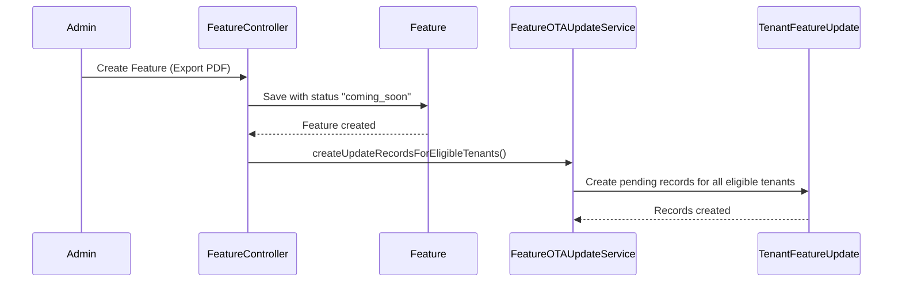
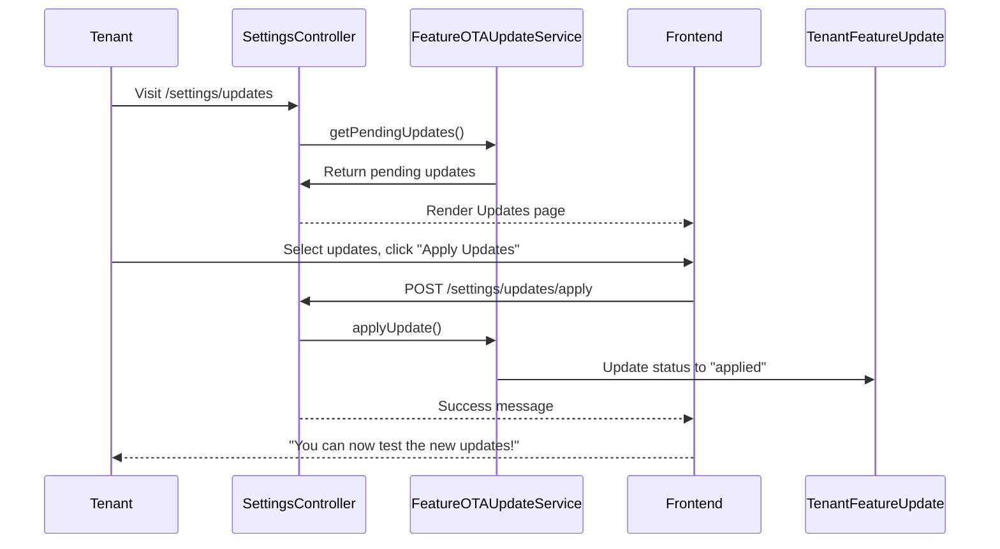

# Over-The-Air (OTA) Updates - Complete Implementation Plan

## Overview

This document outlines the architecture for implementing OTA Updates - a system where:
1. **Admin** adds new features in Feature Management (even before code exists)
2. **Tenants** see available updates in their Settings → Updates tab
3. **Tenants** click "Update" button to acknowledge/apply the new features
4. After updating, tenants can use the new features once developers complete the code

---

## Current System Analysis

### Existing Components

| Component | Location | Status |
|-----------|----------|--------|
| Feature Model | [`app/Models/Feature.php`](app/Models/Feature.php) | ✅ Exists |
| FeatureController | [`app/Http/Controllers/Admin/FeatureController.php`](app/Http/Controllers/Admin/FeatureController.php) | ✅ Exists |
| SettingsController | [`app/Http/Controllers/SettingsController.php`](app/Http/Controllers/SettingsController.php) | ✅ Exists |
| Tenant Features Page | [`resources/js/Pages/Tenant/Settings/Features.vue`](resources/js/Pages/Tenant/Settings/Features.vue) | ✅ Exists |
| NotificationService | [`app/Services/TenantNotificationService.php`](app/Services/TenantNotificationService.php) | ✅ Exists |
| CheckSubscription | [`app/Http/Middleware/CheckSubscription.php`](app/Http/Middleware/CheckSubscription.php) | ✅ Exists |

---

## Implementation Phases

### PHASE 1: Database Schema Changes

#### 1.1 Add New Fields to `features` Table

Create migration [`database/migrations/xxxx_xx_xx_add_ota_fields_to_features_table.php`](database/migrations):

```php
Schema::table('features', function (Blueprint $table) {
    $table->enum('implementation_status', ['coming_soon', 'in_development', 'active', 'deprecated'])->default('coming_soon')->after('is_active');
    $table->string('code_identifier')->nullable()->after('implementation_status');
    $table->date('announced_at')->nullable()->after('code_identifier');
    $table->date('released_at')->nullable()->after('announced_at');
});
```

#### 1.2 Create `tenant_feature_updates` Table

Create new migration [`database/migrations/xxxx_xx_xx_create_tenant_feature_updates_table.php`](database/migrations):

```php
Schema::create('tenant_feature_updates', function (Blueprint $table) {
    $table->id();
    $table->uuid('tenant_id')->index();
    $table->foreignId('feature_id')->constrained()->cascadeOnDelete();
    $table->enum('status', ['pending', 'applied', 'dismissed'])->default('pending');
    $table->timestamp('applied_at')->nullable();
    $table->timestamps();

    $table->unique(['tenant_id', 'feature_id']);
});
```

#### 1.3 Update Feature Model

Update [`app/Models/Feature.php`](app/Models/Feature.php):

```php
protected $fillable = [
    // ... existing
    'implementation_status',
    'code_identifier', 
    'announced_at',
    'released_at',
];

protected $casts = [
    // ... existing
    'announced_at' => 'datetime',
    'released_at' => 'datetime',
];
```

#### 1.4 Create TenantFeatureUpdate Model

Create [`app/Models/TenantFeatureUpdate.php`](app/Models/TenantFeatureUpdate.php):

```php
class TenantFeatureUpdate extends Model
{
    protected $table = 'tenant_feature_updates';
    
    protected $fillable = [
        'tenant_id',
        'feature_id', 
        'status',
        'applied_at',
    ];

    protected $casts = [
        'applied_at' => 'datetime',
    ];

    public function feature()
    {
        return $this->belongsTo(Feature::class);
    }
}
```

---

### PHASE 2: Backend - Admin Feature Management

#### 2.1 Update FeatureController

Modify [`app/Http/Controllers/Admin/FeatureController.php`](app/Http/Controllers/Admin/FeatureController.php):

**Store Method Changes:**
- Add validation for new fields
- Allow admin to select which plans get notified
- Option to notify tenants immediately

```php
public function store(Request $request): RedirectResponse
{
    $validated = $request->validate([
        // ... existing
        'implementation_status' => 'required|in:coming_soon,in_development,active,deprecated',
        'code_identifier' => 'nullable|string|max:255|regex:/^[a-z0-9-]+$/',
        'notify_tenants' => 'boolean',
    ]);

    $validated['announced_at'] = now();
    $feature = Feature::create($validated);

    // Notify tenants if requested
    if ($validated['notify_tenants'] ?? false) {
        $this->notifyEligibleTenants($feature);
    }

    return redirect()->route('admin.features.index')
        ->with('success', 'Feature created successfully.');
}
```

#### 2.2 Create FeatureOTAUpdateService

Create [`app/Services/FeatureOTAUpdateService.php`](app/Services/FeatureOTAUpdateService.php):

```php
namespace App\Services;

use App\Models\Feature;
use App\Models\Subscription;
use App\Models\TenantFeatureUpdate;
use Illuminate\Support\Facades\Log;

class FeatureOTAUpdateService
{
    /**
     * Create feature update records for all eligible tenants
     * (tenants whose plan has this feature enabled)
     */
    public function createUpdateRecordsForEligibleTenants(Feature $feature): int
    {
        $createdCount = 0;

        // Get all active subscriptions for plans that have this feature
        $subscriptions = Subscription::whereHas('plan.features', function ($query) use ($feature) {
            $query->where('features.id', $feature->id)
                ->where(function ($q) {
                    $q->where('value_boolean', true)
                        ->orWhere('value_numeric', '>', 0)
                        ->orWhere('value_tier', '!=', null);
                });
        })->where('stripe_status', 'active')
          ->with('tenant')
          ->get();

        // Get unique tenant IDs
        $tenantIds = $subscriptions->pluck('tenant_id')->unique();

        foreach ($tenantIds as $tenantId) {
            // Check if record already exists
            $exists = TenantFeatureUpdate::where('tenant_id', $tenantId)
                ->where('feature_id', $feature->id)
                ->exists();

            if (!$exists) {
                TenantFeatureUpdate::create([
                    'tenant_id' => $tenantId,
                    'feature_id' => $feature->id,
                    'status' => 'pending',
                ]);
                $createdCount++;
            }
        }

        Log::info("Created {$createdCount} tenant update records for feature: {$feature->name}");
        return $createdCount;
    }

    /**
     * Apply/update feature for a tenant (when they click Update button)
     */
    public function applyUpdate(string $tenantId, array $featureIds): array
    {
        $applied = [];
        
        foreach ($featureIds as $featureId) {
            $update = TenantFeatureUpdate::where('tenant_id', $tenantId)
                ->where('feature_id', $featureId)
                ->first();

            if ($update && $update->status === 'pending') {
                $update->update([
                    'status' => 'applied',
                    'applied_at' => now(),
                ]);
                $applied[] = $featureId;
            }
        }

        return $applied;
    }

    /**
     * Get pending updates for a tenant
     */
    public function getPendingUpdates(string $tenantId)
    {
        return TenantFeatureUpdate::where('tenant_id', $tenantId)
            ->where('status', 'pending')
            ->with('feature')
            ->orderBy('created_at', 'desc')
            ->get();
    }
}
```

---

### PHASE 3: Backend - Tenant Settings Updates Tab

#### 3.1 Add New Routes

Update [`routes/tenant.php`](routes/tenant.php):

```php
// Settings Routes
Route::get('settings', [SettingsController::class, 'index'])->name('settings.index');
Route::post('settings', [SettingsController::class, 'update'])->name('settings.update');

// NEW: Updates Routes
Route::get('settings/updates', [SettingsController::class, 'updates'])->name('settings.updates');
Route::post('settings/updates/apply', [SettingsController::class, 'applyUpdates'])->name('settings.updates.apply');
Route::get('settings/updates/check', [SettingsController::class, 'checkUpdates'])->name('settings.updates.check');
```

#### 3.2 Update SettingsController

Add new methods to [`app/Http/Controllers/SettingsController.php`](app/Http/Controllers/SettingsController.php):

```php
use App\Services\FeatureOTAUpdateService;

/**
 * Display Updates page for tenant
 */
public function updates(Request $request)
{
    $tenant = tenant();
    
    $otaService = app(FeatureOTAUpdateService::class);
    $pendingUpdates = $otaService->getPendingUpdates($tenant->getTenantKey());
    
    // Get subscription info
    $subscription = Subscription::where('tenant_id', $tenant->getTenantKey())
        ->where('stripe_status', 'active')
        ->with('plan')
        ->latest()
        ->first();

    return Inertia::render('Tenant/Settings/Updates', [
        'pending_updates' => $pendingUpdates,
        'subscription' => $subscription,
    ]);
}

/**
 * Apply updates (when tenant clicks Update button)
 */
public function applyUpdates(Request $request)
{
    $validated = $request->validate([
        'feature_ids' => 'required|array',
        'feature_ids.*' => 'exists:features,id',
    ]);

    $tenant = tenant();
    $otaService = app(FeatureOTAUpdateService::class);
    
    $applied = $otaService->applyUpdate($tenant->getTenantKey(), $validated['feature_ids']);

    return back()->with('success', count($applied) . ' update(s) applied successfully! You can now test the new features.');
}

/**
 * Check for available updates (AJAX)
 */
public function checkUpdates(Request $request)
{
    $tenant = tenant();
    $otaService = app(FeatureOTAUpdateService::class);
    $pendingUpdates = $otaService->getPendingUpdates($tenant->getTenantKey());

    return response()->json([
        'has_updates' => $pendingUpdates->count() > 0,
        'count' => $pendingUpdates->count(),
    ]);
}
```

---

### PHASE 4: Frontend - Tenant Updates Tab

#### 4.1 Create Updates Page

Create [`resources/js/Pages/Tenant/Settings/Updates.vue`](resources/js/Pages/Tenant/Settings/Updates.vue):

```vue
<script setup>
import { ref, computed } from 'vue';
import { useForm, usePage } from '@inertiajs/vue3';
import AuthenticatedLayout from '@/Layouts/AuthenticatedLayout.vue';

const props = defineProps({
    pending_updates: Array,
    subscription: Object,
});

const isApplying = ref(false);
const applyingIds = ref([]);

const form = useForm({
    feature_ids: [],
});

const hasUpdates = computed(() => props.pending_updates?.length > 0);

const selectAll = () => {
    if (form.feature_ids.length === pendingUpdates.value.length) {
        form.feature_ids = [];
    } else {
        form.feature_ids = props.pending_updates.map(u => u.feature.id);
    }
};

const applyUpdates = () => {
    if (form.feature_ids.length === 0) return;
    
    isApplying.value = true;
    applyingIds.value = [...form.feature_ids];
    
    form.post(route('settings.updates.apply'), {
        onSuccess: () => {
            isApplying.value = false;
            applyingIds.value = [];
            // Show success message handled by flash
        },
        onError: () => {
            isApplying.value = false;
            applyingIds.value = [];
        }
    });
};

const getStatusBadge = (status) => {
    const badges = {
        'coming_soon': { label: 'Coming Soon', class: 'badge-warning' },
        'in_development': { label: 'In Development', class: 'badge-info' },
        'active': { label: 'Ready', class: 'badge-success' },
    };
    return badges[status] || { label: status, class: 'badge-ghost' };
};
</script>

<template>
    <AuthenticatedLayout>
        <Head title="System Updates" />
        
        <div class="max-w-4xl mx-auto py-12 px-4">
            <!-- Header -->
            <div class="mb-8">
                <h2 class="text-2xl font-bold">System Updates</h2>
                <p class="text-gray-600 mt-1">
                    New features available for your clinic. Click Update to apply.
                </p>
            </div>

            <!-- Plan Info -->
            <div v-if="subscription" class="bg-blue-50 border border-blue-200 rounded-lg p-4 mb-6">
                <p class="text-sm text-blue-800">
                    <strong>Current Plan:</strong> {{ subscription.plan?.name }}
                </p>
            </div>

            <!-- No Updates -->
            <div v-if="!hasUpdates" class="text-center py-12 bg-gray-50 rounded-lg">
                <svg class="mx-auto h-12 w-12 text-green-500" fill="none" viewBox="0 0 24 24" stroke="currentColor">
                    <path stroke-linecap="round" stroke-linejoin="round" stroke-width="2" d="M5 13l4 4L19 7" />
                </svg>
                <h3 class="mt-2 text-lg font-medium text-gray-900">You're all up to date!</h3>
                <p class="mt-1 text-gray-500">No new updates available at this time.</p>
            </div>

            <!-- Updates List -->
            <div v-else class="space-y-4">
                <!-- Select All -->
                <div class="flex items-center justify-between bg-gray-50 p-4 rounded-lg">
                    <label class="flex items-center cursor-pointer">
                        <input 
                            type="checkbox" 
                            :checked="form.feature_ids.length === pending_updates.length"
                            @change="selectAll"
                            class="checkbox checkbox-primary"
                        />
                        <span class="ml-3 font-medium">Select All Updates</span>
                    </label>
                    <span class="text-sm text-gray-500">{{ pending_updates.length }} update(s) available</span>
                </div>

                <!-- Update Cards -->
                <div 
                    v-for="update in pending_updates" 
                    :key="update.id"
                    class="border rounded-lg p-4 hover:shadow-md transition-shadow"
                    :class="form.feature_ids.includes(update.feature.id) ? 'border-primary bg-primary/5' : 'border-gray-200'"
                >
                    <div class="flex items-start gap-4">
                        <input 
                            type="checkbox" 
                            v-model="form.feature_ids"
                            :value="update.feature.id"
                            class="checkbox checkbox-primary mt-1"
                        />
                        
                        <div class="flex-1">
                            <div class="flex items-center gap-2 mb-1">
                                <h3 class="font-semibold text-lg">{{ update.feature.name }}</h3>
                                <span 
                                    class="badge badge-sm"
                                    :class="getStatusBadge(update.feature.implementation_status).class"
                                >
                                    {{ getStatusBadge(update.feature.implementation_status).label }}
                                </span>
                            </div>
                            <p class="text-gray-600 text-sm mb-2">{{ update.feature.description }}</p>
                            
                            <div v-if="update.feature.implementation_status !== 'active'" class="text-xs text-amber-600 bg-amber-50 px-2 py-1 rounded inline-block">
                                ⚠️ This feature is not yet fully available. You can update now but may need to wait for full functionality.
                            </div>
                        </div>
                    </div>
                </div>

                <!-- Apply Button -->
                <div class="sticky bottom-4 bg-white border-t pt-4 mt-6">
                    <button 
                        @click="applyUpdates"
                        :disabled="form.feature_ids.length === 0 || isApplying"
                        class="btn btn-primary w-full"
                        :class="{ 'loading': isApplying }"
                    >
                        <svg v-if="!isApplying" class="w-5 h-5 mr-2" fill="none" viewBox="0 0 24 24" stroke="currentColor">
                            <path stroke-linecap="round" stroke-linejoin="round" stroke-width="2" d="M4 4v5h.582m15.356 2A8.001 8.001 0 004.582 9m0 0H9m11 11v-5h-.581m0 0a8.003 8.003 0 01-15.357-2m15.357 2H15" />
                        </svg>
                        {{ isApplying ? 'Applying Updates...' : `Apply Selected Updates (${form.feature_ids.length})` }}
                    </button>
                </div>
            </div>
        </div>
    </AuthenticatedLayout>
</template>
```

#### 4.2 Update AuthenticatedLayout

Add "Updates" to the Settings submenu in [`resources/js/Layouts/AuthenticatedLayout.vue`](resources/js/Layouts/AuthenticatedLayout.vue:120):

```javascript
{ 
    name: 'Settings', 
    icon: 'cog', 
    permissions: ['manage settings'],
    subItems: [
        { name: 'Clinic Profile', route: 'settings.index', permissions: ['manage settings'] },
        { name: 'Operating Hours', route: 'settings.index', permissions: ['manage settings'] },
        { name: 'QR Code Setup', route: 'settings.index', permissions: ['manage settings'] },
        { name: 'Your Features', route: 'settings.features', permissions: ['manage settings'] },
        { name: 'Updates', route: 'settings.updates', permissions: ['manage settings'] }, // NEW
    ]
},
```

---

### PHASE 5: Backend - Feature Access Control

#### 5.1 Update CheckSubscription Middleware

Update [`app/Http/Middleware/CheckSubscription.php`](app/Http/Middleware/CheckSubscription.php) to check if tenant has applied the update:

```php
// Add this check after feature is enabled
$dynamicFeature = Feature::where('key', $feature)->first();
if ($dynamicFeature) {
    $isEnabled = $dynamicFeature->isEnabledForPlan($plan);
    
    if ($isEnabled) {
        // Check if feature requires tenant update acknowledgment
        $tenantUpdate = TenantFeatureUpdate::where('tenant_id', $tenant->getTenantKey())
            ->where('feature_id', $dynamicFeature->id)
            ->first();
        
        // If feature requires update and tenant hasn't applied it
        if ($tenantUpdate && $tenantUpdate->status !== 'applied') {
            // Allow access but show notice about pending update
            // Or block based on business logic
        }
    }
}
```

---

## Workflow Diagrams

### Admin Flow



### Tenant Flow



---

## Summary of Implementation Steps

### Phase 1: Database
- [ ] Add fields to features table (implementation_status, code_identifier, announced_at, released_at)
- [ ] Create tenant_feature_updates table
- [ ] Update Feature model
- [ ] Create TenantFeatureUpdate model

### Phase 2: Admin Backend
- [ ] Update FeatureController store method
- [ ] Create FeatureOTAUpdateService

### Phase 3: Tenant Backend
- [ ] Add routes in tenant.php
- [ ] Add methods to SettingsController

### Phase 4: Frontend
- [ ] Create Updates.vue page
- [ ] Add Updates menu item to sidebar

### Phase 5: Access Control
- [ ] Update CheckSubscription middleware
- [ ] Update feature flag checks

---

## Key Features

1. **Pre-announcement**: Features can be announced before code exists (coming_soon status)
2. **Plan-based**: Only tenants on relevant plans get the update
3. **Acknowledgment tracking**: Tenant must click "Update" to acknowledge new features
4. **Status tracking**: Track feature lifecycle (coming_soon → in_development → active)
5. **Visual feedback**: Loading spinner, success popup messages

This design gives you a complete OTA update system where tenants can see available updates, click to apply them, and get notified when new features are ready to use.
