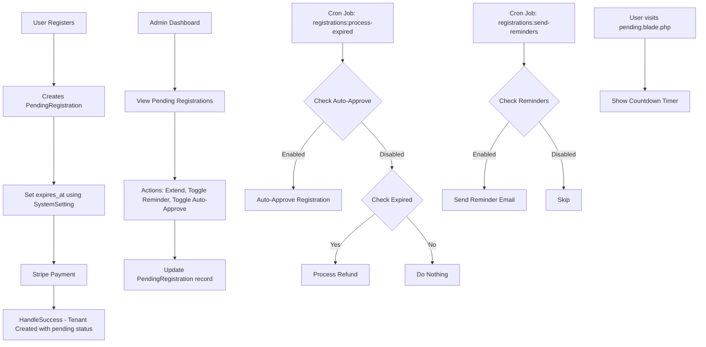

# Pending Registration Enhancement Plan

## Overview
This document outlines the implementation plan for enhancing the tenant registration and subscription management system in the DCMS (Dental Clinic Management System) application.

## Current Status Analysis

### What's Already Implemented ✅

1. **Database Migration** (`database/migrations/2026_03_21_000001_add_enhancement_fields_to_pending_registrations_table.php`)
   - Added 7 new fields to `pending_registrations` table:
     - `pending_timeout_hours` - Custom timeout per registration
     - `reminder_enabled` - Per-registration reminder toggle
     - `reminder_sent_at` - Track when reminder was sent
     - `auto_approve_enabled` - Per-registration auto-approve toggle
     - `auto_approve_scheduled_at` - Scheduled auto-approve time
     - `original_expires_at` - Original expiry before extension
     - `expiry_history` - JSON array tracking all expiry changes

2. **PendingRegistration Model** (`app/Models/PendingRegistration.php`)
   - Added fillable fields and casts
   - Added helper methods:
     - `getEffectiveTimeoutHours()` - Get timeout (per-registration or global default)
     - `isReminderEnabled()` - Check if reminder enabled
     - `isAutoApproveEnabled()` - Check if auto-approve enabled
     - `getTimeRemainingAttribute` - Human-readable countdown
     - `getSecondsRemainingAttribute` - Seconds for countdown timer
     - `extendTime(int $hours)` - Extend pending time
     - `setExpiryTime(Carbon $newExpiresAt)` - Set specific expiry
     - `scopeNeedingReminders()` - Query scope for reminders
     - `scopeEligibleForAutoApprove()` - Query scope for auto-approve

3. **PendingRegistrationController** (`app/Http/Controllers/Admin/PendingRegistrationController.php`)
   - Added new methods:
     - `extendTime()` - POST to extend pending time
     - `setTime()` - POST to set specific expiry
     - `toggleReminder()` - POST to toggle reminder
     - `toggleAutoApprove()` - POST to toggle auto-approve

4. **Console Commands**
   - `ProcessExpiredRegistrations` - Updated with auto-approve logic
   - `SendPendingRegistrationReminders` - New command for reminders

5. **Frontend** (`resources/views/errors/pending.blade.php`)
   - Added countdown timer using `$expires_at`

### What's Remaining ❌

| Priority | Task | Description |
|----------|------|-------------|
| 1 | System Settings Seeds | Add default values to system_settings table |
| 2 | Routes | Add routes for new controller methods |
| 3 | RegistrationController | Update to use configurable timeout |
| 4 | Frontend UI - Pending Registrations | Add action buttons for extend/toggle |
| 5 | Frontend UI - Subscriptions Tab | Show pending registrations |
| 6 | Global Settings Page | Admin UI for default configuration |

---

## Implementation Details

### 1. System Settings Seeds

Add default configuration values to the `system_settings` table:

```php
// database/migrations/2026_03_xx_xxxxxx_seed_pending_registration_settings.php

$settings = [
    // Pending timeout defaults
    [
        'key' => 'pending_timeout_default_hours',
        'value' => '168', // 7 days
        'type' => 'integer',
        'group' => 'registrations',
        'description' => 'Default hours before pending registration expires',
    ],
    
    // Reminder settings
    [
        'key' => 'pending_reminder_global_enabled',
        'value' => 'true',
        'type' => 'boolean',
        'group' => 'registrations',
        'description' => 'Enable/disable reminder emails globally',
    ],
    [
        'key' => 'pending_reminder_hours_before',
        'value' => '24',
        'type' => 'integer',
        'group' => 'registrations',
        'description' => 'Hours before expiry to send reminder',
    ],
    
    // Auto-approve settings
    [
        'key' => 'pending_auto_approve_enabled',
        'value' => 'false',
        'type' => 'boolean',
        'group' => 'registrations',
        'description' => 'Enable/disable auto-approve globally',
    ],
    [
        'key' => 'pending_auto_approve_hours',
        'value' => '168',
        'type' => 'integer',
        'group' => 'registrations',
        'description' => 'Hours after which auto-approve triggers',
    ],
];
```

### 2. Routes Addition

Add to `routes/web.php`:

```php
// Pending Registration Enhancement Routes
$pendingExtend = Route::post('/pending-registrations/{pendingRegistration}/extend', 
    [\App\Http\Controllers\Admin\PendingRegistrationController::class, 'extendTime']);
$pendingSetTime = Route::post('/pending-registrations/{pendingRegistration}/set-time', 
    [\App\Http\Controllers\Admin\PendingRegistrationController::class, 'setTime']);
$pendingToggleReminder = Route::post('/pending-registrations/{pendingRegistration}/toggle-reminder', 
    [\App\Http\Controllers\Admin\PendingRegistrationController::class, 'toggleReminder']);
$pendingToggleAutoApprove = Route::post('/pending-registrations/{pendingRegistration}/toggle-auto-approve', 
    [\App\Http\Controllers\Admin\PendingRegistrationController::class, 'toggleAutoApprove']);

if ($withNames) {
    $pendingExtend->name('pending-registrations.extend');
    $pendingSetTime->name('pending-registrations.set-time');
    $pendingToggleReminder->name('pending-registrations.toggle-reminder');
    $pendingToggleAutoApprove->name('pending-registrations.toggle-auto-approve');
}
```

### 3. RegistrationController Update

Update `createCheckoutSession()` method to use configurable timeout:

```php
// In RegistrationController.php - createCheckoutSession method
$defaultTimeoutHours = SystemSetting::get('pending_timeout_default_hours', 168);

$pendingRegistration = PendingRegistration::create([
    // ... existing fields ...
    'expires_at' => now()->addHours($defaultTimeoutHours),
    'pending_timeout_hours' => $defaultTimeoutHours, // Store the timeout used
]);
```

### 4. Frontend UI - Pending Registrations

Update `resources/js/Pages/Admin/PendingRegistrations/Index.vue`:

```vue
<!-- Add action buttons in the table -->
<td class="px-6 py-4 text-right space-x-2">
    <!-- Extend Time Button -->
    <button 
        @click="openExtendModal(registration)"
        class="text-blue-600 hover:text-blue-900 text-sm"
        title="Extend Time"
    >
        Extend
    </button>
    
    <!-- Reminder Toggle -->
    <button 
        @click="toggleReminder(registration)"
        :class="registration.reminder_enabled ? 'text-green-600' : 'text-gray-400'"
        class="text-sm"
        title="Toggle Reminder"
    >
        {{ registration.reminder_enabled ? 'Reminder ON' : 'Reminder OFF' }}
    </button>
    
    <!-- Auto-Approve Toggle -->
    <button 
        @click="toggleAutoApprove(registration)"
        :class="registration.auto_approve_enabled ? 'text-green-600' : 'text-gray-400'"
        class="text-sm"
        title="Toggle Auto-Approve"
    >
        {{ registration.auto_approve_enabled ? 'Auto-Approve ON' : 'Auto-Approve OFF' }}
    </button>
    
    <!-- Existing buttons -->
    <Link :href="...">View</Link>
    <button v-if="..." @click="...">Approve</button>
    <button v-if="..." @click="...">Reject</button>
</td>
```

### 5. Frontend UI - Subscriptions Tab Enhancement

In `resources/js/Pages/Admin/Subscriptions/Index.vue`:

```vue
<!-- Add tabs for Active Subscriptions and Pending Registrations -->
<template>
    <div>
        <!-- Tabs -->
        <div class="flex border-b mb-4">
            <button 
                @click="activeTab = 'subscriptions'"
                :class="['px-4 py-2', activeTab === 'subscriptions' ? 'border-b-2 border-teal-500' : '']"
            >
                Active Subscriptions
            </button>
            <button 
                @click="activeTab = 'pending'"
                :class="['px-4 py-2', activeTab === 'pending' ? 'border-b-2 border-teal-500' : '']"
            >
                Pending Registrations
                <span class="ml-1 bg-yellow-100 text-yellow-800 text-xs px-2 py-0.5 rounded-full">
                    {{ pendingCount }}
                </span>
            </button>
        </div>
        
        <!-- Subscriptions Table (existing) -->
        <div v-if="activeTab === 'subscriptions'">
            <!-- ... existing code ... -->
        </div>
        
        <!-- Pending Registrations Table (new) -->
        <div v-if="activeTab === 'pending'">
            <!-- Reuse or adapt from PendingRegistrations/Index.vue -->
        </div>
    </div>
</template>
```

### 6. Global Settings Page

Add to `resources/js/Pages/Admin/SystemSettings/Index.vue`:

```vue
<!-- Add registrations settings section -->
<div v-if="settings.registrations">
    <h3 class="text-lg font-medium mb-4">Pending Registration Settings</h3>
    
    <div class="space-y-4">
        <!-- Default Timeout -->
        <div class="flex items-center justify-between">
            <div>
                <label>Default Pending Timeout</label>
                <p class="text-sm text-gray-500">Hours before pending registration expires</p>
            </div>
            <input 
                type="number" 
                v-model="settings.registrations.pending_timeout_default_hours"
                class="border rounded px-3 py-2 w-24"
            />
        </div>
        
        <!-- Reminder Global Toggle -->
        <div class="flex items-center justify-between">
            <div>
                <label>Enable Reminders</label>
                <p class="text-sm text-gray-500">Send reminder emails before expiry</p>
            </div>
            <toggle v-model="settings.registrations.pending_reminder_global_enabled" />
        </div>
        
        <!-- Reminder Hours Before -->
        <div class="flex items-center justify-between">
            <div>
                <label>Reminder Timing</label>
                <p class="text-sm text-gray-500">Hours before expiry to send reminder</p>
            </div>
            <input 
                type="number" 
                v-model="settings.registrations.pending_reminder_hours_before"
                class="border rounded px-3 py-2 w-24"
            />
        </div>
        
        <!-- Auto-Approve Global Toggle -->
        <div class="flex items-center justify-between">
            <div>
                <label>Enable Auto-Approve</label>
                <p class="text-sm text-gray-500">Automatically approve after timeout</p>
            </div>
            <toggle v-model="settings.registrations.pending_auto_approve_enabled" />
        </div>
        
        <!-- Auto-Approve Hours -->
        <div class="flex items-center justify-between">
            <div>
                <label>Auto-Approve After</label>
                <p class="text-sm text-gray-500">Hours after which to auto-approve</p>
            </div>
            <input 
                type="number" 
                v-model="settings.registrations.pending_auto_approve_hours"
                class="border rounded px-3 py-2 w-24"
            />
        </div>
    </div>
</div>
```

---

## Auto-Reject Recommendation

**Decision: DO NOT implement auto-reject feature**

### Rationale:
1. **Financial Risk**: Auto-reject triggers automatic refunds which can cause:
   - Payment processing fee losses
   - Customer disputes and chargebacks
   - Potential legal issues

2. **Current Behavior is Adequate**: The existing `ProcessExpiredRegistrations` command already handles expired registrations:
   - Checks if payment was made
   - Processes Stripe refund
   - Sends refund email
   - Updates status to `refunded`

3. **Better Alternatives**:
   - Multiple reminder emails before expiry
   - Admin dashboard alerts for pending registrations
   - Email notifications to admin for pending registrations approaching expiry

---

## Cron Schedule Recommendations

Add to `app/Console/Kernel.php`:

```php
protected function schedule(Schedule $schedule)
{
    // Run every minute to process expired registrations
    $schedule->command('registrations:process-expired')->everyMinute();
    
    // Run every hour to send reminders
    $schedule->command('registrations:send-reminders')->hourly();
}
```

---

## Data Flow Diagram



---

## Testing Checklist

- [ ] Create new registration and verify timeout is set from system settings
- [ ] Extend pending time and verify countdown updates
- [ ] Toggle reminder and verify state persists
- [ ] Toggle auto-approve and verify state persists
- [ ] Run `registrations:process-expired` and verify auto-approve works
- [ ] Run `registrations:send-reminders` and verify emails sent
- [ ] Test pending.blade.php countdown timer
- [ ] Test subscription tab shows pending registrations

---

## Files Summary

| File | Action |
|------|--------|
| `database/migrations/2026_03_xx_xxxxxx_seed_pending_registration_settings.php` | Create - Seed system settings |
| `routes/web.php` | Update - Add new routes |
| `app/Http/Controllers/RegistrationController.php` | Update - Use configurable timeout |
| `app/Http/Controllers/Admin/SubscriptionController.php` | Update - Add pending registrations to index |
| `resources/js/Pages/Admin/PendingRegistrations/Index.vue` | Update - Add action buttons |
| `resources/js/Pages/Admin/Subscriptions/Index.vue` | Update - Add pending tab |
| `resources/js/Pages/Admin/SystemSettings/Index.vue` | Update - Add registrations settings |
| `app/Console/Kernel.php` | Update - Add scheduled commands |

---

## Implementation Priority

1. **Phase 1 - Backend Foundation**
   - System settings seeds
   - Routes
   - RegistrationController update

2. **Phase 2 - Admin UI**
   - Pending Registrations action buttons
   - Subscription tab enhancement
   - Global settings page

3. **Phase 3 - Testing & Refinement**
   - Manual testing
   - Bug fixes
   - UX improvements
