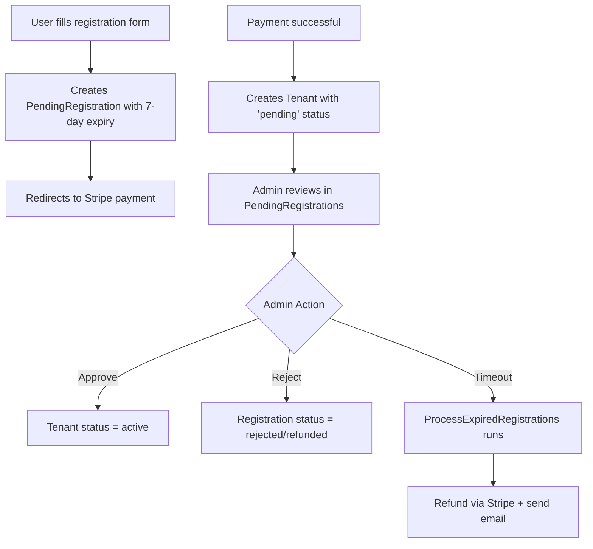
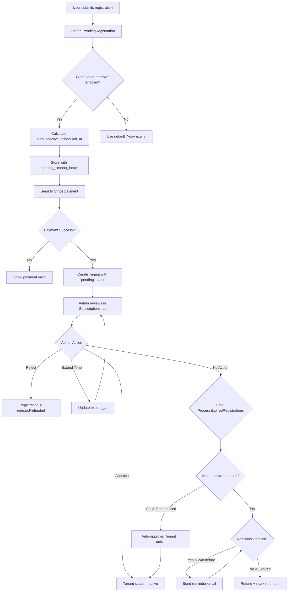

# Tenant Registration & Subscription Management Enhancement Plan

## Executive Summary

This document outlines a comprehensive implementation plan for enhancing the tenant registration and subscription management system in the DCMS platform. The enhancements include:

1. **Subscription Tab Enhancement** - Add subscription management features with a modal for viewing/managing clinic subscriptions (payment methods, billing cycles, days remaining)
2. **Pending Registrations** - Keep as separate page with dynamic pending time management, auto-approve, and reminders
3. **Pending Time Display** - Show countdown timer to tenants on pending page

## Current System Analysis

### Existing Components

| Component | Location | Description |
|-----------|----------|-------------|
| [`PendingRegistration`](app/Models/PendingRegistration.php) | `app/Models/PendingRegistration.php` | Model with status: pending/approved/rejected/refunded |
| [`Tenant`](app/Models/Tenant.php) | `app/Models/Tenant.php` | Model with status: active/inactive/suspended |
| [`Subscription`](app/Models/Subscription.php) | `app/Models/Subscription.php` | Subscription model linked to tenants |
| [`SystemSetting`](app/Models/SystemSetting.php) | `app/Models/SystemSetting.php` | Global settings storage |
| [`RegistrationController`](app/Http/Controllers/RegistrationController.php) | `app/Http/Controllers/RegistrationController.php` | Handles new tenant registration |
| [`PendingRegistrationController`](app/Http/Controllers/Admin/PendingRegistrationController.php) | `app/Http/Controllers/Admin/PendingRegistrationController.php` | Admin actions for pending registrations |
| [`TenantController`](app/Http/Controllers/Admin/TenantController.php) | `app/Http/Controllers/Admin/TenantController.php` | Tenant management |
| [`ProcessExpiredRegistrations`](app/Console/Commands/ProcessExpiredRegistrations.php) | `app/Console/Commands/ProcessExpiredRegistrations.php` | Handles expired registrations |

### Current Registration Flow



### Current Issues Identified

1. **Hardcoded 7-day expiry** - No ability to customize pending time per-registration
2. **No pending time visibility** - Tenants cannot see when they'll be approved
3. **No auto-approve option** - Manual approval required even for legitimate registrations
4. **No reminder system** - No automated notifications before expiry
5. **Subscription tab disconnected** - Pending registrations shown separately, not in Subscriptions
6. **No auto-reject toggle** - Expired registrations automatically refunded (may want to change)

---

## Requirements Breakdown

### 1. Subscription Tab - Management Modal
**Requirement**: Add subscription management features to the Subscription tab with a modal for viewing/managing clinic subscriptions

**Current State**: 
- [`Admin/Subscriptions/Index.vue`](resources/js/Pages/Admin/Subscriptions/Index.vue) only shows approved subscriptions in a table
- No modal for detailed subscription management

**Implementation**:
- Add "Manage Subscriptions" button to the Subscription tab header
- Create a modal that displays:
  - All subscriptions with Stripe status (Active, Pending, Past Due)
  - Days remaining until renewal
  - Payment method status (Stripe, GCash, PayMaya, Bank Transfer, Card)
  - Quick actions: View Details, Extend, Suspend, Cancel
- Add payment method management (activate/deactivate options)
- Add billing cycle management (view/modify end dates)

### 2. Pending Registrations Page (Separate)
**Requirement**: Dynamic pending time management, auto-approve toggle, and reminders for new tenant/clinic applications

**Location**: Keep as separate page (not in Subscription tab)

**Implementation**:
- Enhance the existing Pending Registrations page with:
  - Extend time functionality
  - Auto-approve toggle per registration
  - Reminder toggle per registration

### 2. Dynamic Pending Time Management
**Requirement**: Add ability to set/extend pending time for new tenant/clinic applications

**Implementation**:
- Add `pending_timeout_hours` field to [`PendingRegistration`](app/Models/PendingRegistration.php)
- Add global default in [`SystemSetting`](app/Models/SystemSetting.php)
- Create new methods in [`PendingRegistrationController`](app/Http/Controllers/Admin/PendingRegistrationController.php):
  - `extendTime(Request $request, PendingRegistration $registration)`
  - `setTime(Request $request, PendingRegistration $registration)`

### 3. Due Date Reminders Toggle
**Requirement**: Add ON/OFF toggle for auto due date reminders (both globally and per-registration)

**Implementation**:
- Add system settings keys:
  - `pending_reminder_global_enabled` (boolean, default: true)
  - `pending_reminder_hours_before` (integer, default: 24)
- Add fields to PendingRegistration:
  - `reminder_enabled` (boolean, nullable - inherits from global if null)
  - `reminder_sent_at` (datetime, nullable)

### 4. Pending Time Display
**Requirement**: Show pending time to new tenants so they know when to expect approval/rejection

**Implementation**:
- Modify [`pending.blade.php`](resources/views/errors/pending.blade.php:23) to show countdown timer
- Display actual `expires_at` datetime from the registration
- Show remaining time dynamically with JavaScript

### 5. Auto-Approve Feature
**Requirement**: Toggle to auto-approve if admin doesn't take action within the specified time

**Implementation**:
- Add system settings:
  - `pending_auto_approve_enabled` (boolean, default: false)
  - `pending_auto_approve_hours` (integer, default: 168 = 7 days)
- Add field to PendingRegistration:
  - `auto_approve_enabled` (boolean, nullable)
- Modify [`ProcessExpiredRegistrations`](app/Console/Commands/ProcessExpiredRegistrations.php:29) command to handle auto-approve logic

### 6. Rejection Handling (Auto-Reject)
**Requirement**: Evaluate if auto-reject toggle is needed

**Recommendation**: **NO - Do not implement auto-reject**

**Rationale**:
1. Existing expiration behavior already handles rejection via refund
2. Auto-reject may cause legal/compliance issues
3. Manual review provides quality control
4. Rejection should remain a deliberate admin action

---

## Database Changes Required

### Migration: Add Pending Registration Enhancement Fields

```php
// database/migrations/2026_03_21_000001_add_enhancement_fields_to_pending_registrations_table.php

Schema::table('pending_registrations', function (Blueprint $table) {
    // Pending timeout management
    $table->unsignedInteger('pending_timeout_hours')->nullable()->after('expires_at');
    
    // Reminder system
    $table->boolean('reminder_enabled')->nullable()->after('pending_timeout_hours');
    $table->timestamp('reminder_sent_at')->nullable()->after('reminder_enabled');
    
    // Auto-approve
    $table->boolean('auto_approve_enabled')->nullable()->after('reminder_sent_at');
    $table->timestamp('auto_approve_scheduled_at')->nullable()->after('auto_approve_enabled');
    
    // Extended expiry tracking
    $table->timestamp('original_expires_at')->nullable()->after('auto_approve_scheduled_at');
    $table->json('expiry_history')->nullable()->after('original_expires_at');
});
```

### System Settings to Add

| Key | Type | Default | Group | Description |
|-----|------|---------|-------|-------------|
| `pending_timeout_default_hours` | integer | 168 | registration | Default pending time in hours (7 days) |
| `pending_reminder_global_enabled` | boolean | true | registration | Enable automatic reminders |
| `pending_reminder_hours_before` | integer | 24 | registration | Hours before expiry to send reminder |
| `pending_auto_approve_enabled` | boolean | false | registration | Enable auto-approve feature |
| `pending_auto_approve_hours` | integer | 168 | registration | Hours after which to auto-approve |

---

## Implementation Roadmap

### Phase 1: Database & Model Updates (Priority: HIGH)

1. **Create migration** for new fields
2. **Update PendingRegistration model** with new fields and accessors
3. **Add scope methods** for querying pending registrations needing attention

### Phase 2: System Settings Integration (Priority: HIGH)

1. **Seed new system settings** with defaults
2. **Create helper service** for reading/writing pending registration settings

### Phase 3: Backend Controller Enhancements (Priority: HIGH)

1. **Update RegistrationController** to use configurable pending timeout
2. **Add new methods to PendingRegistrationController**:
   - `extendTime()` - Extend pending time by specified hours
   - `setTime()` - Set specific expiry time
   - `toggleReminder()` - Enable/disable reminders per-registration
   - `toggleAutoApprove()` - Enable/disable auto-approve per-registration

### Phase 4: Console Command Updates (Priority: HIGH)

1. **Enhance ProcessExpiredRegistrations** to:
   - Handle auto-approve logic before marking as expired
   - Send reminder notifications
   - Track expiry history

2. **Create new command**: `registrations:send-reminders`
   - Runs daily to check pending registrations approaching expiry
   - Sends email reminders if enabled

### Phase 5: Admin UI - Subscription Tab Management Modal (Priority: HIGH)

1. **Modify SubscriptionController::index()** to include full subscription details
2. **Update Admin/Subscriptions/Index.vue**:
   - Add "Manage Subscriptions" button in header
   - Create modal with subscription management features:
     - List all subscriptions with status (Active, Pending, Past Due)
     - Display days remaining for each subscription
     - Show payment method status (Stripe, GCash, PayMaya, Bank Transfer, Card)
     - Quick actions: View Details, Extend, Suspend, Cancel
   - Add payment method toggle controls
   - Add billing cycle end date display/modification
3. **Add subscription filtering**: All, Active, Past Due, Cancelled

### Phase 6: Admin UI - Pending Registration Details (Priority: MEDIUM)

1. **Enhance PendingRegistrations/Show.vue**:
   - Display time remaining with countdown
   - Add "Extend Time" button with time picker
   - Add toggle switches for reminder and auto-approve
   - Show expiry history

### Phase 7: Tenant UI - Pending Page Enhancement (Priority: MEDIUM)

1. **Update pending.blade.php**:
   - Display actual `expires_at` from database
   - Show countdown timer based on configured timeout
   - Add "Contact Support" link
   - Show status message based on reminder settings

### Phase 8: Testing & Polish (Priority: MEDIUM)

1. Unit tests for new model methods
2. Integration tests for controller methods
3. UI/UX testing for countdown timers
4. Edge case handling

---

## API Endpoints to Create/Modify

### Subscription Management Endpoints (Modal)

| Method | Endpoint | Controller | Description |
|--------|----------|------------|-------------|
| GET | `/admin/subscriptions/manage` | SubscriptionController | Get all subscriptions for modal |
| POST | `/admin/subscriptions/{id}/toggle-payment-method` | SubscriptionController | Toggle payment method (Stripe/GCash/PayMaya/Bank) |
| POST | `/admin/subscriptions/{id}/extend-billing` | SubscriptionController | Extend billing cycle |
| POST | `/admin/subscriptions/{id}/suspend` | SubscriptionController | Suspend subscription |
| POST | `/admin/subscriptions/{id}/activate` | SubscriptionController | Activate/reinstate subscription |

### Pending Registration Endpoints

| Method | Endpoint | Controller | Description |
|--------|----------|------------|-------------|
| POST | `/admin/pending-registrations/{id}/extend` | PendingRegistrationController | Extend pending time |
| POST | `/admin/pending-registrations/{id}/set-time` | PendingRegistrationController | Set specific expiry |
| POST | `/admin/pending-registrations/{id}/toggle-reminder` | PendingRegistrationController | Toggle reminder |
| POST | `/admin/pending-registrations/{id}/toggle-auto-approve` | PendingRegistrationController | Toggle auto-approve |

### Modified Endpoints

| Method | Endpoint | Changes |
|--------|----------|---------|
| GET | `/admin/subscriptions` | Include full subscription details with payment methods |
| POST | `/registration/checkout` | Use configurable pending timeout |

---

## Code Changes Summary

### Files to Create

1. `database/migrations/2026_03_21_000001_add_enhancement_fields_to_pending_registrations_table.php`
2. `app/Console/Commands/SendPendingRegistrationReminders.php`
3. `app/Services/PendingRegistrationService.php`

### Files to Modify

1. `app/Models/PendingRegistration.php` - Add fields, scopes, accessors
2. `app/Models/Subscription.php` - Add payment method status fields
3. `app/Models/SystemSetting.php` - No changes needed (seed new settings)
4. `app/Http/Controllers/RegistrationController.php` - Use configurable timeout
5. `app/Http/Controllers/Admin/PendingRegistrationController.php` - Add new methods
6. `app/Http/Controllers/Admin/SubscriptionController.php` - Add subscription management endpoints
7. `app/Console/Commands/ProcessExpiredRegistrations.php` - Add auto-approve logic
8. `resources/js/Pages/Admin/Subscriptions/Index.vue` - Add management modal
9. `resources/js/Pages/Admin/PendingRegistrations/Show.vue` - Add management UI
10. `resources/views/errors/pending.blade.php` - Show countdown timer
11. `database/migrations/2026_03_16_000001_create_system_settings_table.php` - Seed new settings

### New Fields for Subscription Model (Payment Method Management)

To support payment method management, add these fields to subscriptions table:

```php
// database/migrations/2026_03_21_000002_add_payment_method_fields_to_subscriptions_table.php

$table->boolean('stripe_enabled')->default(true)->after('payment_method');
$table->boolean('gcash_enabled')->default(false)->after('stripe_enabled');
$table->boolean('paymaya_enabled')->default(false)->after('gcash_enabled');
$table->boolean('bank_transfer_enabled')->default(false)->after('paymaya_enabled');
$table->timestamp('billing_cycle_end')->nullable()->after('ends_at');
```

---

## Mermaid: Enhanced Registration Flow



---

## Configuration Options Summary

### Global Settings (System Settings)

| Setting | Type | Default | Description |
|---------|------|---------|-------------|
| `pending_timeout_default_hours` | integer | 168 | Default hours before expiry |
| `pending_reminder_global_enabled` | boolean | true | Enable/disable all reminders |
| `pending_reminder_hours_before` | integer | 24 | Hours before expiry to send reminder |
| `pending_auto_approve_enabled` | boolean | false | Enable auto-approve |
| `pending_auto_approve_hours` | integer | 168 | Hours after which to auto-approve |

### Per-Registration Settings (PendingRegistration fields)

| Field | Type | Description |
|-------|------|-------------|
| `pending_timeout_hours` | integer? | Override global timeout |
| `reminder_enabled` | boolean? | Override global reminder setting |
| `reminder_sent_at` | datetime? | When reminder was sent |
| `auto_approve_enabled` | boolean? | Override global auto-approve |
| `auto_approve_scheduled_at` | datetime? | When auto-approve will occur |
| `original_expires_at` | datetime? | Original expiry before extensions |
| `expiry_history` | json | Track all expiry changes |

---

## Acceptance Criteria

### Subscription Tab (Management Modal)
1. **Manage Button**: "Manage Subscriptions" button visible in Subscription tab header
2. **Modal Display**: Modal shows all subscriptions with:
   - Clinic name and subdomain
   - Stripe status (Active, Pending, Past Due)
   - Days remaining until renewal
   - Payment method toggles (Stripe, GCash, PayMaya, Bank Transfer)
3. **Quick Actions**: Admin can View, Extend, Suspend, or Cancel from modal
4. **Billing Cycle**: Admin can view and modify billing cycle end dates

### Pending Registrations Page (Separate)
5. **Dynamic Timeout**: Admin can extend/shorten pending time for any registration
6. **Reminders**: Tenants receive email reminders 24 hours before expiry (if enabled)
7. **Countdown Display**: Tenant sees accurate countdown on pending page
8. **Auto-Approve**: System auto-approves registrations after specified time (if enabled)
9. **Status Sync**: PendingRegistration status stays in sync with Tenant status
10. **No Auto-Reject**: System does not auto-reject; uses existing refund mechanism

---

## Timeline Estimation (No time estimates provided - see implementation steps)

The implementation is divided into 8 phases with clear, actionable steps. Each phase builds upon the previous one, allowing for incremental testing and validation.

---

*Plan created: 2026-03-21*
*Last updated: 2026-03-21*
